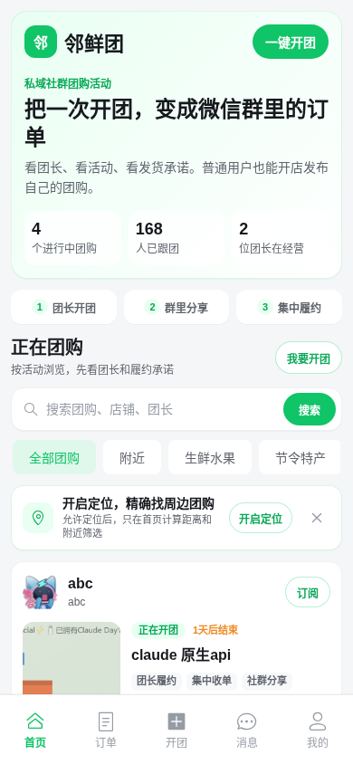
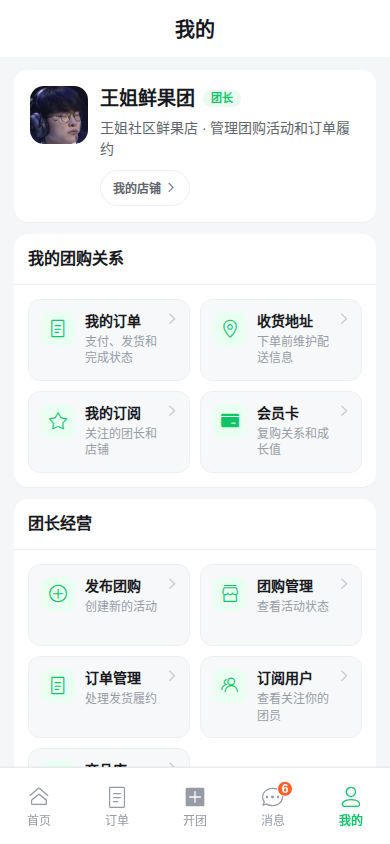
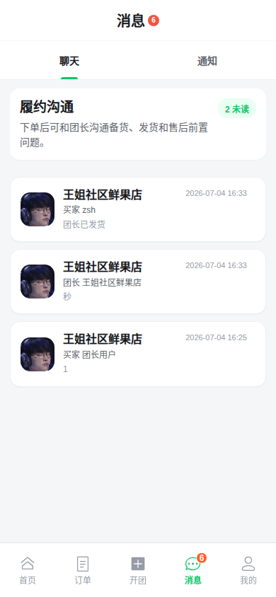

# 邻鲜团 · 私域社群团购 H5

一个面向微信私域场景的社群团购系统。项目围绕“团长开店、发布团购、社群分享、用户跟团下单、团长履约、订阅复购”构建，前端是移动端 H5 体验，后端提供完整 REST API、交易状态流转和 P1 增强能力。

> 当前项目处于 P1 前端逐页改造阶段：后端 P1 能力已基本完成，前端正在对齐真实接口、消息通知、位置筛选、上传资产和团长经营链路。

## 截图

以下截图来自本地真实服务 `http://localhost:5174`，未使用接口 mock。

| 首页团购流 | 团购详情 |
|---|---|
|  |  |

| 我的 | 消息 |
|---|---|
|  |  |

## 核心能力

- 公开浏览：团购首页、团购详情、团长主页、分享落地页。
- 搜索与附近：支持团购关键词搜索、浏览器定位、5km 附近团购筛选和距离展示。
- 用户交易：地址管理、购物车、确认订单、优惠券预览、下单、模拟支付、订单列表和订单详情。
- 私域关系：订阅团长、我的订阅、会员卡、站内通知、未读数轮询。
- 团长经营：创建店铺、我的店铺、商品库、发布团购、团购管理、订单管理、发货、订阅用户查看。
- 内容与资产：团购结构化内容块、多图展示、本地图片上传、上传引用治理。
- 分享链路：团长生成团购分享二维码，用户通过分享 token 进入隐藏团购并继续下单。
- 履约沟通：订单关系下的买家与店铺团长轻量聊天，支持文本、图片和订单卡片。

## 技术栈

| 层 | 技术 |
|---|---|
| 前端 | Vue 3, Vite, TypeScript, Vue Router, Pinia, Vant, Axios |
| 前端测试 | Vitest, Vue Test Utils, Playwright |
| 后端 | Java 17, Spring Boot 3, Spring Web, Validation, MyBatis-Plus |
| 数据库 | MySQL, Flyway |
| 后端测试 | JUnit 5, MockMvc, H2, swagger-request-validator |

## 业务模型

```text
User 用户
  -> Leader 团长身份
  -> Store 店铺
  -> Product 商品库
  -> GroupBuy 团购活动
  -> GroupBuyItem 团购商品
  -> Order 订单
  -> Shipment 发货记录
```

核心关系不是传统货架电商的“商品中心”，而是私域团购里的“团长信任 + 活动传播 + 集中履约”。

## 快速启动

### 1. 准备数据库

后端默认连接本机 MySQL：

```yaml
url: jdbc:mysql://localhost:3306/groupshop
username: root
password: root
```

创建数据库：

```bash
mysql -uroot -proot -e "CREATE DATABASE IF NOT EXISTS groupshop DEFAULT CHARACTER SET utf8mb4 COLLATE utf8mb4_unicode_ci;"
```

启动后 Flyway 会自动执行 `backend/src/main/resources/db/migration/` 下的迁移。

### 2. 启动后端

```bash
cd backend
mvn spring-boot:run
```

默认端口：`http://localhost:8080`

### 3. 启动前端

```bash
cd frontend
npm install
npm run dev
```

默认前端端口由 Vite 分配，常见为：

```text
http://localhost:5173
http://localhost:5174
```

前端 dev server 已配置代理：

- `/api/v1` -> `http://localhost:8080`
- `/uploads` -> `http://localhost:8080`

如需切换后端地址：

```bash
VITE_API_BASE_URL=http://localhost:8080 npm run dev
```

## 开发账号

登录页内置“开发测试账号”折叠入口，可快速使用 mock-login 进入系统。该入口调用真实后端 `POST /api/v1/auth/mock-login`，不是前端假登录。

常用手机号：

| 场景 | 手机号 |
|---|---|
| 买家测试用户 | `13800000000` |
| 团长测试用户 | `13700000000` |

团长身份取决于当前本地数据库是否已创建店铺；普通用户可从“开团 / 创建店铺”流程激活团长身份。

## 测试

后端：

```bash
cd backend
mvn test
```

前端：

```bash
cd frontend
npm run typecheck
npm run lint
npm run test:unit
npm run build
npm run test:e2e
```

最近一次验证结果：

```text
backend: mvn test -> 598 tests passed
frontend: typecheck / lint / unit / build / e2e -> passed
```

## 项目结构

```text
.
├── backend/                 # Spring Boot 后端
│   ├── src/main/java/       # 业务模块、Controller、Service、Mapper
│   ├── src/main/resources/  # application.yml、Flyway 迁移
│   └── src/test/java/       # MockMvc 与 Service 测试
├── frontend/                # Vue H5 前端
│   ├── src/api/             # Axios API 封装
│   ├── src/components/      # 通用 H5 组件
│   ├── src/views/           # 买家端、团长端页面
│   ├── src/stores/          # Pinia 状态
│   └── tests/               # Vitest 与 Playwright
├── docs/                    # 产品、API、联调与开发批次文档
├── docs/assets/screenshots/ # README 截图
├── DESIGN.md                # 前端视觉系统
└── AGENTS.md                # AI 开发协作规则
```

## 关键文档

| 文档 | 说明 |
|---|---|
| [功能需求定义](docs/功能需求定义.md) | 项目目标、MVP/P1/P2 范围 |
| [API 设计](docs/API设计.md) | REST API 契约 |
| [API 风格规范](docs/API风格规范.md) | 响应结构、错误码、金额与状态口径 |
| [数据模型设计](docs/数据模型设计.md) | 核心对象与表结构 |
| [页面与交互文档](docs/页面与交互文档.md) | 页面入口和主流程 |
| [前后端联调文档](docs/前后端联调文档.md) | 联调顺序、样例和验收点 |
| [前端产品与页面设计准则](docs/前端产品与页面设计准则.md) | 私域团购页面表达规则 |
| [DESIGN.md](DESIGN.md) | 移动端视觉系统和 UI 验收清单 |

## 阶段边界

当前实现包含完整 MVP 闭环和多项 P1 能力，但仍明确不接入：

- 真实微信支付：当前使用模拟支付。
- 公众号 / 微信服务通知：当前使用站内通知和 REST 轮询。
- 平台后台：当前聚焦 H5 买家端与团长端。
- 帮卖佣金结算：只保留后续扩展边界。
- 任意 HTML 富文本：团购详情使用结构化内容块。

## License

本项目使用 [MIT License](LICENSE)。
