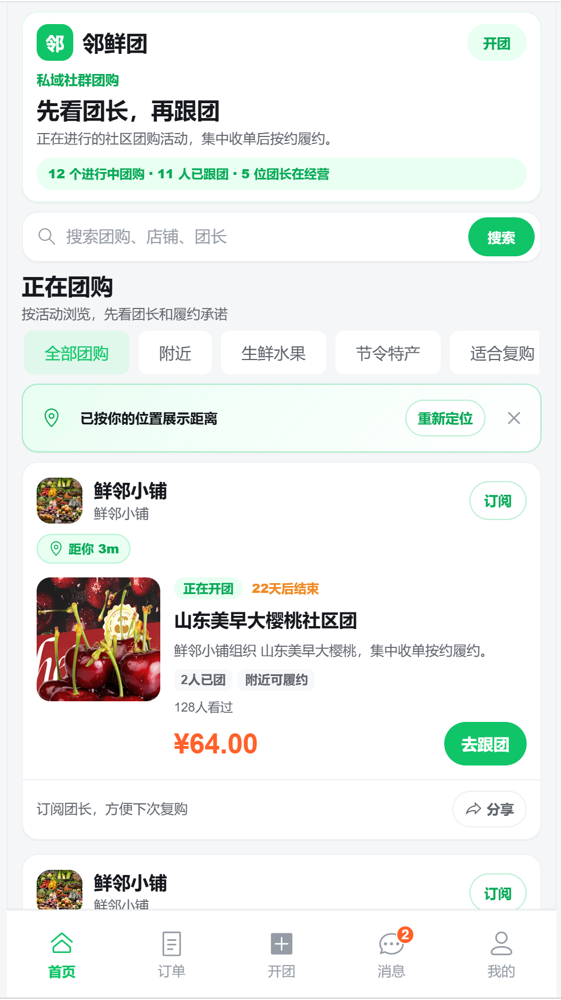
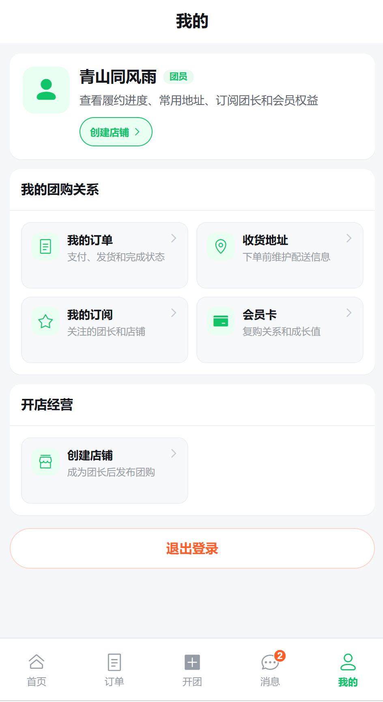
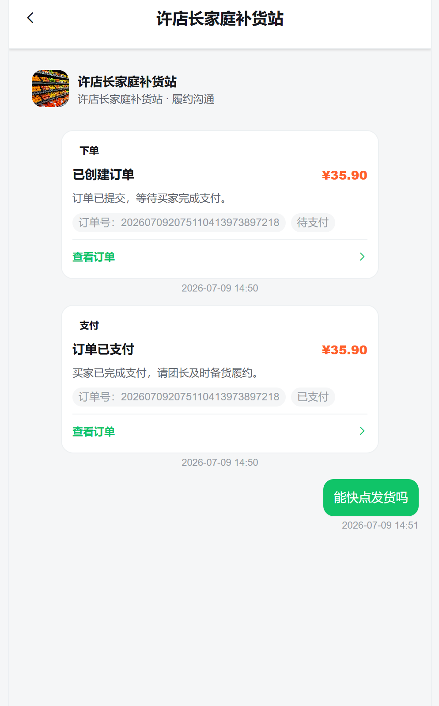
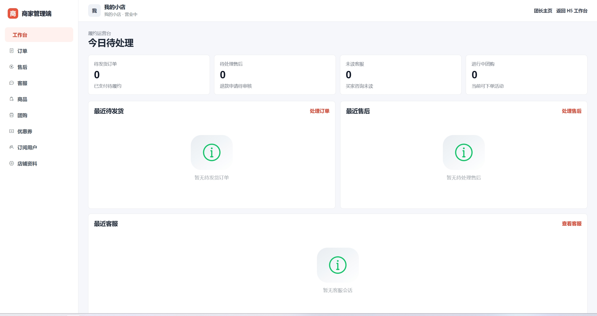
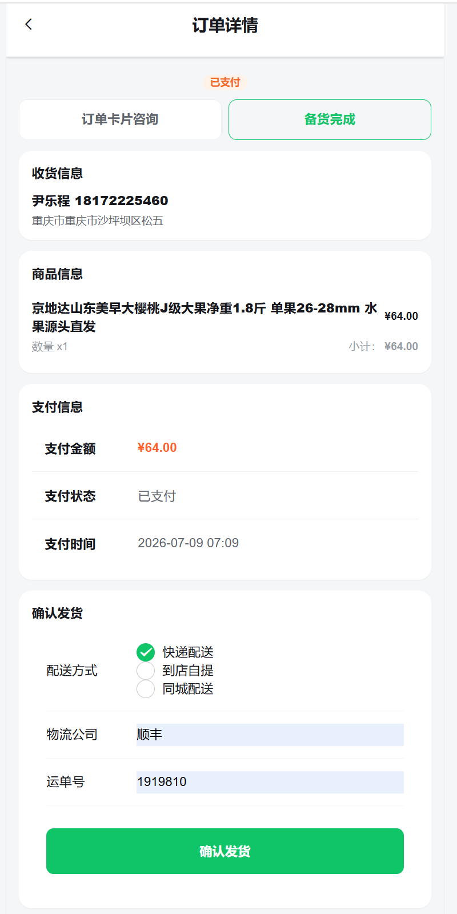

# 邻鲜团 · 私域社群团购系统

邻鲜团是一个面向微信私域传播场景的社群团购项目。系统围绕“团长开店、商品入库、发布团购、社群分享、买家跟团下单、支付、履约、订阅复购”构建，前端提供移动端 H5 / Android WebView 体验，后端提供 REST API、交易状态流转、数据治理和演示数据脚本。

当前项目已经覆盖完整 MVP 交易闭环，并继续补齐商品分类、收藏、浏览历史、购物车、优惠券、会员成长、售后、通知、上传资产、订单聊天、发布前 AI 润色和支付宝沙箱演示支付等增强能力。

## 截图

截图位于 `docs/assets/screenshots/`，对应当前 H5 视觉与页面内容。

| 首页 | 团购详情 | 我的 |
|---|---|---|
|  |  |  |

| 消息 | 团长主页 | 团长订单 |
|---|---|---|
|  |  |  |

## 核心能力

- 公开浏览：团购首页、团购详情、团长主页、分享 token 落地页。
- 私域交易：地址、购物车、订单预览、优惠券抵扣、下单、支付、订单列表和订单详情。
- 支付模式：默认本地模拟支付；可用 `SANDBOX_PAYMENT_ENABLED` 开启支付宝沙箱 H5 支付演示。
- 团长经营：创建店铺、商品库、商品分类、发布团购、团购管理、订单发货、订阅用户、优惠券管理。
- 内容表达：团购多图、结构化内容块、商品详情图、发布前 AI 润色建议。
- 用户关系：收藏、浏览历史、订阅团长、会员卡、会员成长、站内通知和未读数轮询。
- 售后与沟通：买家申请售后、团长审核、模拟退款、订单上下文轻量聊天。
- 上传资产治理：本地图片上传、引用登记、上传资产记录。
- 演示数据：支持 API 驱动的复杂演示数据脚本，便于答辩、展示和回归测试。
- Android 演示包：前端通过 Capacitor 打包 APK，当前 Android 壳指向 `https://shop.zesuy.top`。

## 技术栈

| 层 | 技术 |
|---|---|
| 前端 | Vue 3, Vite, TypeScript, Vue Router, Pinia, Vant, Axios |
| Android 壳 | Capacitor Android |
| 前端测试 | Vitest, Vue Test Utils, Playwright |
| 后端 | Java 17, Spring Boot 3, Spring Web, Validation, MyBatis-Plus |
| 数据库 | MySQL 8, Flyway |
| 支付演示 | 本地模拟支付, 支付宝沙箱 H5 支付 |
| 后端测试 | JUnit 5, MockMvc, H2, swagger-request-validator |
| 部署 | Docker Compose, Nginx, Spring Boot, MySQL |

## 项目结构

```text
.
├── backend/                 # Spring Boot 后端服务
│   ├── src/main/java/       # Controller / Service / DTO / Mapper
│   ├── src/main/resources/  # application.yml 和 Flyway 迁移
│   ├── src/test/java/       # MockMvc、Service、合同和迁移测试
│   └── scripts/             # 本地演示数据重置与种子脚本
├── frontend/                # Vue H5 前端和 Capacitor Android 壳
│   ├── src/api/             # Axios API 封装
│   ├── src/components/      # 通用组件
│   ├── src/views/           # 买家端、团长端、商家管理端页面
│   ├── src/stores/          # Pinia 状态
│   ├── tests/               # Vitest 与 Playwright
│   └── android/             # Capacitor Android 工程
├── deploy/nginx/            # 前端静态资源托管和 API 反代配置
├── docs/                    # 产品、API、数据模型、联调和开发文档
├── DESIGN.md                # 前端视觉系统
├── AGENTS.md                # AI 协作与项目开发规则
├── docker-compose.yml       # 单机部署编排
└── .env.deploy.example      # 部署环境变量模板
```

## 快速启动

### 1. 准备数据库

本地后端默认使用 MySQL：

```bash
mysql -uroot -proot -e "CREATE DATABASE IF NOT EXISTS groupshop DEFAULT CHARACTER SET utf8mb4 COLLATE utf8mb4_unicode_ci;"
```

后端启动时 Flyway 会自动执行 `backend/src/main/resources/db/migration/` 下的迁移。

### 2. 启动后端

```bash
cd backend
mvn spring-boot:run
```

默认地址：

```text
http://localhost:8080
http://localhost:8080/api/v1/health
```

### 3. 启动前端

本项目在 WSL/Linux 环境开发，前端命令建议通过 zsh 加载本机 Node 环境：

```bash
zsh -ic 'cd frontend && npm install'
zsh -ic 'cd frontend && npm run dev'
```

Vite dev server 会输出本地访问地址，常见为：

```text
http://localhost:5173
http://localhost:5174
```

开发代理：

- `/api/v1` -> `http://localhost:8080`
- `/uploads` -> `http://localhost:8080`

如需指定 API 地址：

```bash
VITE_API_BASE_URL=http://localhost:8080 zsh -ic 'cd frontend && npm run dev'
```

## 开发账号

登录页内置开发测试账号入口，调用真实后端 `POST /api/v1/auth/mock-login`，不是前端假登录。

| 场景 | 手机号 |
|---|---|
| 买家测试用户 | `13800000000` |
| 团长测试用户 | `13700000000` |

团长身份取决于当前数据库是否已有店铺；普通用户可以通过“创建店铺”流程成为团长。

## 演示数据

推荐使用 API 驱动的复杂演示数据脚本。它会通过真实接口创建账号、店铺、商品、团购、订单、通知、图片等数据。

本地 Docker Compose 栈示例：

```bash
docker compose --env-file .env.deploy exec -T mysql \
  sh -c 'mysql -u"$MYSQL_USER" -p"$MYSQL_PASSWORD" "$MYSQL_DATABASE"' \
  < backend/scripts/reset-dev-data.sql

API_BASE_URL=http://localhost/api/v1 TZ=UTC \
  zsh -ic 'node backend/scripts/seed-realistic-demo.mjs'
```

如果后端直接跑在 `8080`：

```bash
API_BASE_URL=http://localhost:8080/api/v1 \
  zsh -ic 'node backend/scripts/seed-realistic-demo.mjs'
```

更多说明见 [backend/scripts/README.md](backend/scripts/README.md)。

## 支付说明

默认支付模式是本地模拟支付，适合开发、自动化测试和常规演示：

```env
SANDBOX_PAYMENT_ENABLED=false
```

开启支付宝沙箱后，买家点击“去支付”会跳转到支付宝沙箱 H5 支付页；订单只在支付宝异步通知验签成功后变为已支付。

```env
SANDBOX_PAYMENT_ENABLED=true
ALIPAY_SANDBOX_APP_ID=
ALIPAY_SANDBOX_APP_PRIVATE_KEY=
ALIPAY_SANDBOX_PUBLIC_KEY=
ALIPAY_SANDBOX_GATEWAY=https://openapi-sandbox.dl.alipaydev.com/gateway.do
BACKEND_PUBLIC_BASE_URL=https://your-backend.example.com
FRONTEND_PUBLIC_BASE_URL=https://your-frontend.example.com
```

支付宝沙箱对浏览器、网页登录和移动端唤起存在限制。本项目保留模拟支付闭环，避免常规验收依赖真实沙箱环境。

## Android APK

前端已接入 Capacitor Android。当前配置见 `frontend/capacitor.config.ts`：

```text
appId: com.zesuy.groupshop
appName: 邻鲜团
server.url: https://shop.zesuy.top
```

构建调试 APK：

```bash
zsh -ic 'cd frontend && npm run apk:debug'
```

常用输出位置：

```text
frontend/android/app/build/outputs/apk/debug/app-debug.apk
```

## 测试

后端：

```bash
cd backend
mvn test
```

前端：

```bash
zsh -ic 'cd frontend && npm run typecheck'
zsh -ic 'cd frontend && npm run lint'
zsh -ic 'cd frontend && npm run test:unit'
zsh -ic 'cd frontend && npm run build'
zsh -ic 'cd frontend && npm run test:e2e'
```

常用局部验证：

```bash
zsh -ic 'cd frontend && npm run test:unit -- product-form'
zsh -ic 'cd frontend && npm run test:e2e -- merchant-admin.spec.ts'
```

## Docker Compose 单机部署

根目录提供一套单机部署编排：MySQL、后端 Spring Boot 和前端 Nginx 同机运行。前端容器托管 H5 静态资源，并把 `/api/v1` 与 `/uploads` 同源反代到后端。

### 1. 准备环境变量

```bash
cp .env.deploy.example .env.deploy
vim .env.deploy
```

至少修改：

```env
MYSQL_PASSWORD=change-me
MYSQL_ROOT_PASSWORD=change-me
```

### 2. 构建并启动

```bash
docker compose --env-file .env.deploy up -d --build
```

默认暴露：

- `http://服务器IP/`：前端 H5 和管理端
- `http://服务器IP/api/v1/health`：后端健康检查

后端 `8080` 和 MySQL `3306` 不直接暴露到宿主机。HTTPS 可由云厂商负载均衡、宿主机反代或 Certbot 层处理。

### 3. 常用运维命令

```bash
docker compose --env-file .env.deploy ps
docker compose --env-file .env.deploy logs -f backend
docker compose --env-file .env.deploy restart backend
docker compose --env-file .env.deploy down
```

数据持久化在 Docker volumes：

- `mysql_data`：MySQL 数据
- `backend_uploads`：用户上传图片

删除数据需显式执行：

```bash
docker compose --env-file .env.deploy down -v
```

## 关键文档

| 文档 | 说明 |
|---|---|
| [docs/功能需求定义.md](docs/功能需求定义.md) | 功能范围和优先级 |
| [docs/API设计.md](docs/API设计.md) | REST API 契约 |
| [docs/API风格规范.md](docs/API风格规范.md) | 响应结构、错误码、金额和状态口径 |
| [docs/数据模型设计.md](docs/数据模型设计.md) | 核心对象、表结构和业务约束 |
| [docs/页面与交互文档.md](docs/页面与交互文档.md) | 页面入口和交互流程 |
| [docs/前后端联调文档.md](docs/前后端联调文档.md) | 联调顺序、样例、验收点和测试数据准备 |
| [docs/前端产品与页面设计准则.md](docs/前端产品与页面设计准则.md) | 私域团购前端表达规则 |
| [docs/团购活动内容块设计.md](docs/团购活动内容块设计.md) | 团购结构化内容块口径 |
| [DESIGN.md](DESIGN.md) | 移动端视觉系统和 UI 验收清单 |

## 阶段边界

当前项目聚焦私域社群团购，不实现以下能力：

- 真实微信支付。
- 公众号或微信服务通知。
- 平台后台。
- 帮卖佣金结算。
- 积分商城。
- 任意 HTML 富文本。
- 复杂客服中心或实时 IM。

## 子目录 README

- [frontend/README.md](frontend/README.md)
- [backend/README.md](backend/README.md)
- [docs/README.md](docs/README.md)

## License

本项目使用 [MIT License](LICENSE)。
