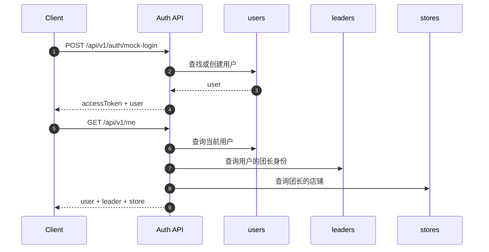
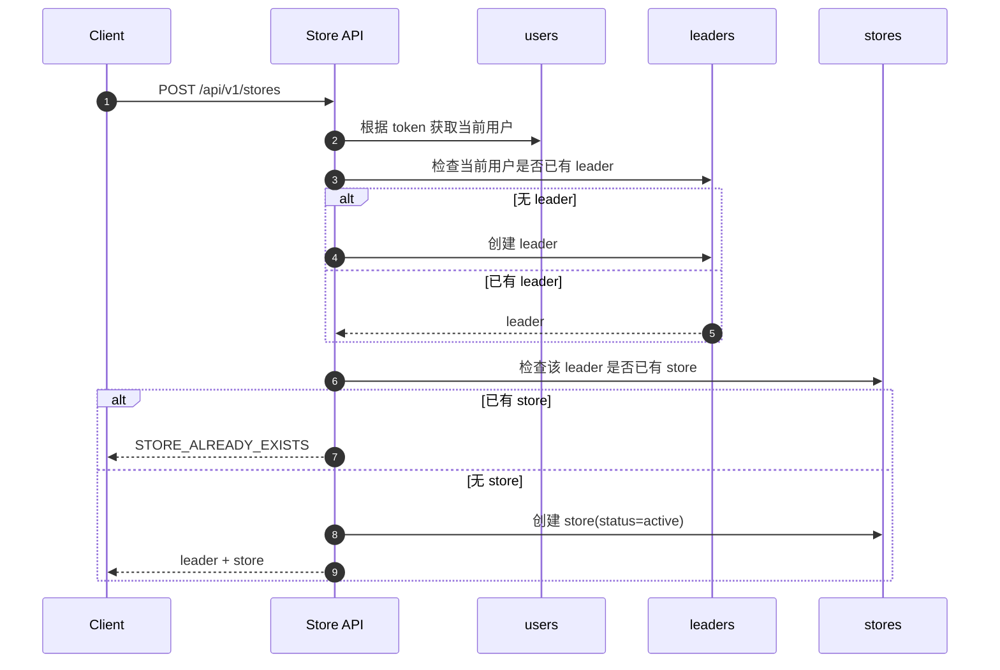
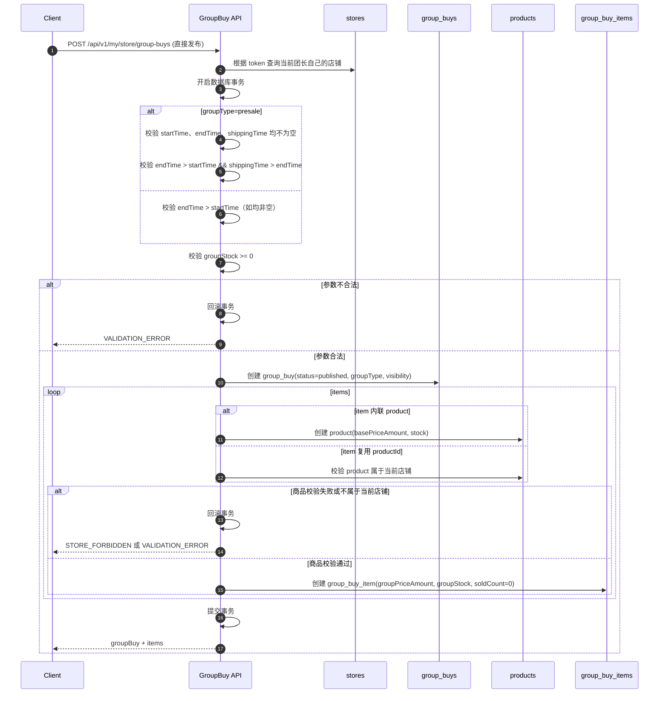
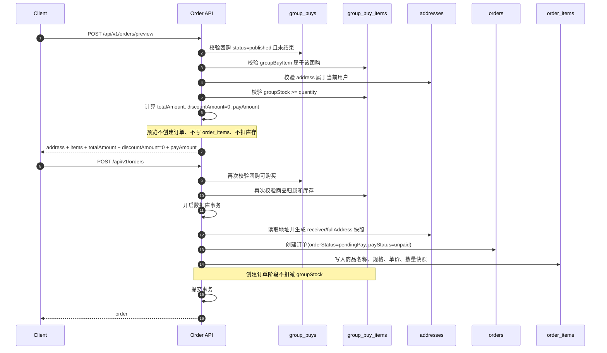
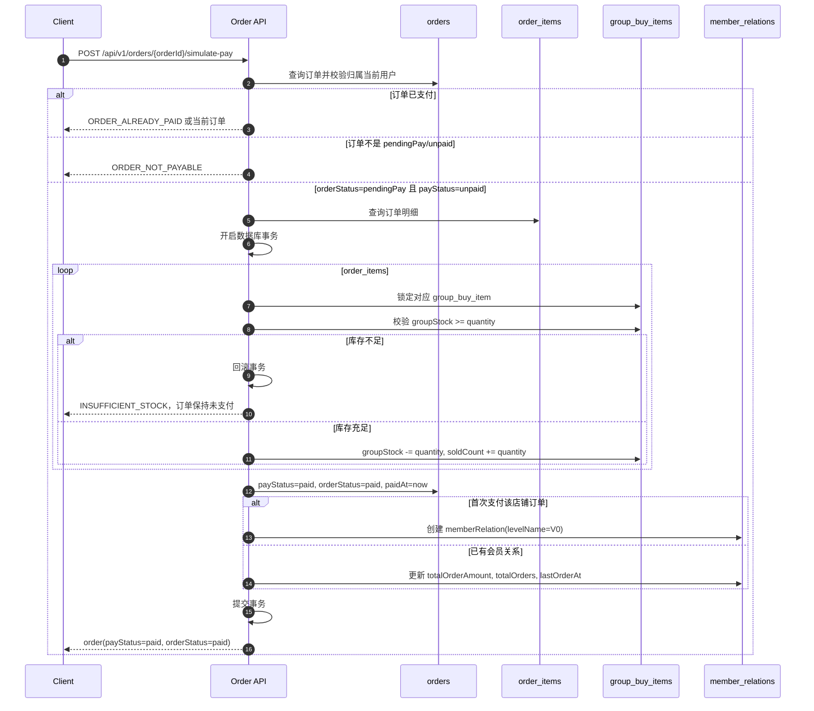
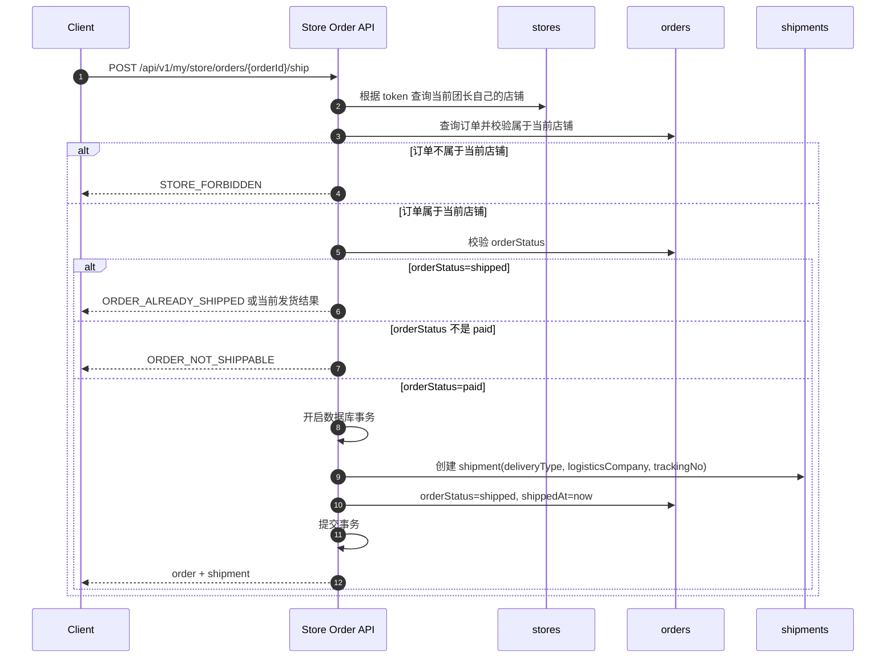
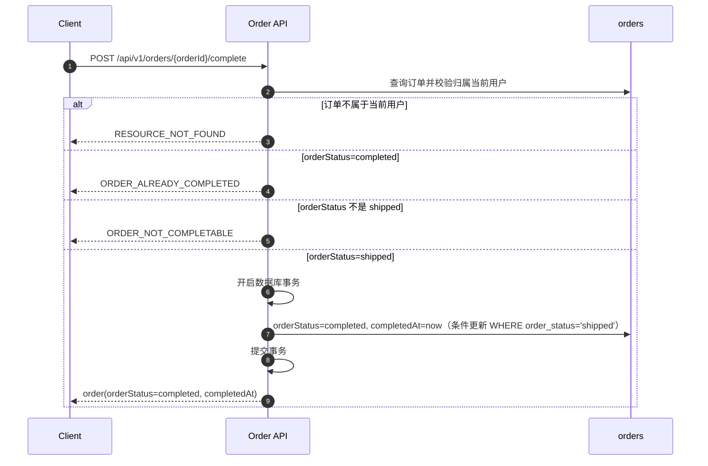
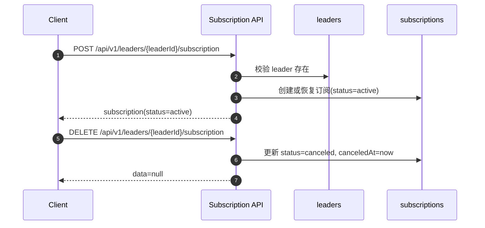

# API 设计

> 本文基于 `docs/功能需求定义.md` 和 `docs/数据模型设计.md` 编写，接口风格遵循 `docs/API风格规范.md`。
>
> 范围：只设计 MVP 必需 API。P1/P2 能力仅在文末列出，不展开接口细节。

---

## 1. 设计边界

MVP API 支撑以下闭环：

```text
用户浏览团购
→ 查看团长主页 / 商品详情
→ 登录后下单
→ 模拟支付
→ 查看订单
→ 团长发货
```

```text
用户登录
→ 创建店铺
→ 自动生成团长身份
→ 创建商品
→ 发布普通团购
→ 管理自己店铺的订单
```

MVP 不设计真实微信支付、优惠券、售后退款完整流程、帮卖分销、积分商城、平台后台、公众号推送。

MVP 统一约定：

| 约定 | 说明 |
|---|---|
| 金额 | API 层全部使用整数分，字段名以 `Amount` 结尾 |
| 状态 | API 使用 `camelCase` 枚举，如 `pendingPay`、`afterSale` |
| 数据库映射 | 如果数据库使用 `snake_case` 状态或 decimal 金额，由 DTO 层转换为 API 格式 |
| SKU | MVP 采用单规格方案，不设计 SKU 管理接口；`skuId` 作为 P1/P2 后续字段，不在 MVP 请求中使用 |
| 幂等 | MVP 不要求支持 `Idempotency-Key`；创建订单由前端防重复点击，支付/取消/发货通过状态校验和数据库事务防重复；`Idempotency-Key` 作为 P1 增强 |

---

## 2. API 模块总览

| 模块 | 说明 | 登录要求 |
|---|---|---|
| 认证与当前用户 | 登录、获取当前用户信息 | 部分需要 |
| 公共浏览 | 首页团购流、团购详情、团长主页 | 不需要 |
| 店铺与团长 | 创建店铺、查看自己的团长身份和店铺 | 需要 |
| 分类 | 获取商品分类列表 | 不需要 |
| 商品 | 团长管理自己店铺商品 | 需要团长身份 |
| 团购 | 团长发布普通团购，用户查看团购 | 部分需要 |
| 地址 | 用户管理收货地址 | 需要 |
| 订单 | 用户下单、查看订单、模拟支付、取消、确认收货 | 需要 |
| 购物车 | 购物车管理（加购、改数量、删除）、购物车结算预览 | 需要 |
| 团长订单 | 团长查看自己店铺订单、发货 | 需要团长身份 |
| 订阅 | 关注 / 取消关注团长 | 需要 |
| 会员卡 | 查看基础会员关系 | 需要 |
| 收藏 | 收藏 / 取消收藏团购活动 | 需要 |
| 浏览历史 | 查看和删除浏览记录 | 需要 |

---

## 3. 通用对象摘要

### 3.1 User

```json
{
  "id": 1,
  "nickname": "用户昵称",
  "avatarUrl": "https://example.com/avatar.png",
  "phone": "13800000000",
  "hasLeader": true,
  "leaderId": 10,
  "storeId": 20
}
```

### 3.2 Leader

```json
{
  "id": 10,
  "userId": 1,
  "displayName": "某某团长",
  "avatarUrl": "https://example.com/avatar.png",
  "bio": "主营生鲜水果",
  "memberCount": 0,
  "followerCount": 0
}
```

### 3.3 Store

```json
{
  "id": 20,
  "leaderId": 10,
  "name": "某某的小店",
  "logoUrl": "https://example.com/logo.png",
  "description": "店铺简介",
  "defaultDeliveryType": "express",
  "distributionEnabled": false,
  "status": "active",
  "latitude": 31.2304,
  "longitude": 121.4737
}
```

### 3.4 GroupBuy

```json
{
  "id": 100,
  "storeId": 20,
  "leaderId": 10,
  "title": "山东蜜桃团购",
  "introduction": "产地直发，香甜多汁",
  "coverImageUrl": "https://example.com/cover.png",
  "galleryImageUrls": [
    "https://example.com/group-1.png",
    "https://example.com/group-2.png"
  ],
  "contentBlocks": [
    {
      "type": "section",
      "title": "为什么开这个团",
      "text": "这批蜜桃来自固定合作果园。"
    }
  ],
  "groupType": "normal",
  "deliveryType": "express",
  "shippingTime": "2026-06-30T18:00:00+08:00",
  "startTime": "2026-06-24T12:00:00+08:00",
  "endTime": "2026-07-01T12:00:00+08:00",
  "visibility": "public",
  "status": "published"
}
```

`galleryImageUrls`：团购活动多图，最多 9 张。  
`contentBlocks`：团购活动结构化正文块，保持原始顺序，最多 20 块。类型：`paragraph` / `section` / `image` / `list` / `deliveryNote`。旧数据无内容块时返回空数组 `[]`。

### 3.5 GroupBuyItem

```json
{
  "id": 1001,
  "groupBuyId": 100,
  "productId": 501,
  "displayName": "白玉蜜桃 5 斤装",
  "groupPriceAmount": 2990,
  "groupStock": 100,
  "soldCount": 0,
  "sortOrder": 1
}
```

说明：`groupStock` 表示当前剩余可售库存，发布团购时为初始可售库存，MVP 必须为大于等于 0 的整数，不允许使用 -1 表示不限库存；支付成功后按购买数量扣减。`soldCount` 表示已支付售出数量。

### 3.6 Order

```json
{
  "id": 9001,
  "orderNo": "202606240001",
  "userId": 1,
  "leaderId": 10,
  "storeId": 20,
  "groupBuyId": 100,
  "totalAmount": 2990,
  "discountAmount": 0,
  "payAmount": 2990,
  "payStatus": "unpaid",
  "orderStatus": "pendingPay",
  "remark": "请尽快发货",
  "receiverName": "张三",
  "receiverPhone": "13800000000",
  "province": "浙江省",
  "city": "杭州市",
  "district": "西湖区",
  "detail": "某某路 1 号",
  "fullAddress": "浙江省杭州市西湖区某某路 1 号",
  "paidAt": null,
  "shippedAt": null,
  "completedAt": null,
  "items": []
}
```

说明：`paidAt`、`shippedAt`、`completedAt` 为时间戳字符串（ISO-8601），对应状态未发生时字段可省略（无 null 值）；契约上允许 nullable。`paidAt` 在模拟支付成功后填充，`shippedAt` 在团长发货后填充，`completedAt` 在买家确认收货后填充。

---

## 4. 认证与当前用户

### 4.1 发送验证码

```http
POST /api/v1/auth/codes
```

用途：手机号验证码登录 / 注册的第一步。当前演示环境返回固定验证码 `123456`；后续接入短信服务时，生产环境不返回 `devCode`，前端接口不变。

请求：

```json
{
  "phone": "13800000000",
  "scene": "login"
}
```

字段：

| 字段 | 类型 | 必填 | 说明 |
|---|---|---|---|
| `phone` | string | 是 | 11 位手机号 |
| `scene` | string | 是 | `login` 或 `register` |

响应：

```json
{
  "success": true,
  "data": {
    "expiresInSeconds": 300,
    "devCode": "123456"
  },
  "traceId": "req_001"
}
```

### 4.2 手机号验证码登录

```http
POST /api/v1/auth/login
```

用途：已注册用户使用手机号和验证码登录。手机号不存在时返回 `RESOURCE_NOT_FOUND`，引导用户注册。

请求：

```json
{
  "phone": "13800000000",
  "code": "123456"
}
```

响应同 `POST /api/v1/auth/mock-login`，返回 `accessToken` 和用户摘要。

### 4.3 手机号验证码注册

```http
POST /api/v1/auth/register
```

用途：新用户使用手机号验证码创建账号，并补充最小资料。手机号已存在时返回 `RESOURCE_CONFLICT`。

请求：

```json
{
  "phone": "13800000000",
  "code": "123456",
  "nickname": "用户昵称"
}
```

响应同 `POST /api/v1/auth/mock-login`，返回 `accessToken` 和用户摘要。注册时头像保持为空，用户进入个人主页后再维护头像资料。

### 4.4 模拟登录

```http
POST /api/v1/auth/mock-login
```

用途：开发测试和 E2E 使用。正式登录 / 注册页默认使用手机号验证码接口；`mock-login` 保留为快捷测试账号入口。

请求：

```json
{
  "nickname": "用户昵称",
  "avatarUrl": "https://example.com/avatar.png",
  "phone": "13800000000"
}
```

响应：

```json
{
  "success": true,
  "data": {
    "accessToken": "mock_access_token",
    "user": {
      "id": 1,
      "nickname": "用户昵称",
      "avatarUrl": "https://example.com/avatar.png",
      "phone": "13800000000",
      "hasLeader": false,
      "leaderId": null,
      "storeId": null
    }
  },
  "traceId": "req_001"
}
```

### 4.5 获取当前用户

```http
GET /api/v1/me
```

登录：需要。

响应：返回当前用户、团长身份和店铺摘要。

```json
{
  "success": true,
  "data": {
    "user": {
      "id": 1,
      "nickname": "用户昵称",
      "avatarUrl": "https://example.com/avatar.png",
      "phone": "13800000000",
      "hasLeader": true,
      "leaderId": 10,
      "storeId": 20
    },
    "leader": {
      "id": 10,
      "displayName": "某某团长",
      "avatarUrl": "https://example.com/avatar.png"
    },
    "store": {
      "id": 20,
      "name": "某某的小店",
      "logoUrl": "https://example.com/logo.png",
      "status": "active"
    }
  },
  "traceId": "req_001"
}
```

### 4.6 更新当前用户资料

```http
PATCH /api/v1/me
```

登录：需要。

请求：仅允许修改当前用户自己的昵称和头像。

```json
{
  "nickname": "新的昵称",
  "avatarUrl": "https://example.com/avatar.png"
}
```

响应：同 `GET /api/v1/me`，返回更新后的当前用户上下文。

---

## 5. 公共浏览 API

### 5.1 首页团购列表

```http
GET /api/v1/group-buys
```

登录：不需要。

查询参数：

| 参数 | 类型 | 说明 |
|---|---|---|
| keyword | string | 关键词搜索，匹配团购标题、介绍、团购商品展示名和商品名称 |
| categoryId | number | 按商品分类筛选，匹配团购商品所属分类 |
| page | number | 页码 |
| pageSize | number | 每页数量 |
| latitude | number | 用户纬度（WGS84），与 longitude 同时提供 |
| longitude | number | 用户经度（WGS84），与 latitude 同时提供 |
| maxDistanceMeters | number | 距离筛选（米），需同时提供 latitude/longitude |
| sort | string | 排序方式，`distance` 表示按距离升序，需同时提供 latitude/longitude |

> 注意：公共列表固定只返回 `status=published` 且 `visibility=public` 的团购。不支持 `status` 参数，传入 `status` 将返回 `VALIDATION_ERROR`。
> 坐标缺失、非法、店铺无坐标时，距离字段返回 `null`；普通浏览不受影响。

响应：

```json
{
  "success": true,
  "data": {
    "items": [
      {
        "id": 100,
        "title": "山东蜜桃团购",
        "coverImageUrl": "https://example.com/cover.png",
        "status": "published",
        "endTime": "2026-07-01T12:00:00+08:00",
        "minPriceAmount": 2990,
        "soldCount": 12,
        "leader": {
          "id": 10,
          "displayName": "某某团长",
          "avatarUrl": "https://example.com/avatar.png"
        },
        "store": {
          "id": 20,
          "name": "某某的小店",
          "latitude": 31.2304,
          "longitude": 121.4737,
          "distanceMeters": 164874,
          "distanceText": "164.9km"
        }
      }
    ],
    "page": 1,
    "pageSize": 20,
    "total": 1,
    "hasMore": false
  },
  "traceId": "req_001"
}
```

### 5.2 团购详情

```http
GET /api/v1/group-buys/{groupBuyId}
```

登录：不需要。

查询参数：

| 参数 | 类型 | 说明 |
|---|---|---|
| latitude | number | 用户纬度（WGS84），与 longitude 同时提供 |
| longitude | number | 用户经度（WGS84），与 latitude 同时提供 |

> 坐标缺失、非法、店铺无坐标时，距离字段返回 `null`。

响应：返回团购、团长、店铺、团购商品列表。

```json
{
  "success": true,
  "data": {
    "groupBuy": {
      "id": 100,
      "title": "山东蜜桃团购",
      "introduction": "产地直发，香甜多汁",
      "coverImageUrl": "https://example.com/cover.png",
      "galleryImageUrls": [
        "https://example.com/group-1.png"
      ],
      "contentBlocks": [
        {"type": "paragraph", "text": "本团产地直发，适合囤货。"}
      ],
      "groupType": "normal",
      "deliveryType": "express",
      "shippingTime": "2026-06-30T18:00:00+08:00",
      "startTime": "2026-06-24T12:00:00+08:00",
      "endTime": "2026-07-01T12:00:00+08:00",
      "status": "published"
    },
    "leader": {
      "id": 10,
      "displayName": "某某团长",
      "avatarUrl": "https://example.com/avatar.png",
      "followerCount": 0
    },
    "store": {
      "id": 20,
      "name": "某某的小店",
      "logoUrl": "https://example.com/logo.png",
      "latitude": 31.2304,
      "longitude": 121.4737,
      "distanceMeters": 164874,
      "distanceText": "164.9km"
    },
    "items": [
      {
        "id": 1001,
        "productId": 501,
        "displayName": "白玉蜜桃 5 斤装",
        "groupPriceAmount": 2990,
        "groupStock": 100,
        "soldCount": 12,
        "coverImageUrl": "https://example.com/product.png",
        "product": {
          "id": 501,
          "name": "白玉蜜桃",
          "description": "商品自己的口感、规格说明。",
          "coverImageUrl": "https://example.com/product.png",
          "detailImageUrls": [
            "https://example.com/product-detail-1.png"
          ],
          "basePriceAmount": 3990,
          "status": "active"
        }
      }
    ],
    "featuredItem": {
      "id": 1001,
      "productId": 501,
      "displayName": "白玉蜜桃 5 斤装",
      "groupPriceAmount": 2990,
      "groupStock": 100,
      "soldCount": 12,
      "coverImageUrl": "https://example.com/product.png",
      "product": {
        "id": 501,
        "name": "白玉蜜桃",
        "description": "商品自己的口感、规格说明。",
        "coverImageUrl": "https://example.com/product.png",
        "detailImageUrls": [],
        "basePriceAmount": 3990,
        "status": "active"
      }
    },
    "viewer": {
      "subscribed": false,
      "favorited": false
    }
  },
  "traceId": "req_001"
}
```

说明：`viewer.favorited` 仅在登录用户时返回，标识当前用户是否已收藏该团购。未登录用户此字段为 `false`。

### 5.3 团长主页

```http
GET /api/v1/leaders/{leaderId}/homepage
```

登录：不需要。

查询参数：

| 参数 | 类型 | 说明 |
|---|---|---|
| page | number | 团购列表页码 |
| pageSize | number | 团购列表每页数量 |

响应：

```json
{
  "success": true,
  "data": {
    "leader": {
      "id": 10,
      "displayName": "某某团长",
      "avatarUrl": "https://example.com/avatar.png",
      "bio": "主营生鲜水果",
      "memberCount": 0,
      "followerCount": 0
    },
    "store": {
      "id": 20,
      "name": "某某的小店",
      "logoUrl": "https://example.com/logo.png",
      "description": "店铺简介",
      "defaultDeliveryType": "express"
    },
    "viewer": {
      "subscribed": false
    },
    "groupBuys": {
      "items": [],
      "page": 1,
      "pageSize": 20,
      "total": 0,
      "hasMore": false
    }
  },
  "traceId": "req_001"
}
```

---

## 6. 店铺与团长 API

### 6.0 `/my/store` 路径说明

`/my/store` 表示当前登录团长自己的店铺。

所有 `/my/store/**` 接口都从 token 获取当前用户身份，再由服务端查找当前用户对应的团长身份和店铺；客户端不能传 `storeId` 决定操作对象。

即使路径中出现 `productId`、`groupBuyId`、`orderId`，服务端也必须校验该资源属于当前团长自己的店铺。

### 6.1 创建店铺

```http
POST /api/v1/stores
```

登录：需要。

业务规则：

- 当前用户没有团长身份时，创建店铺会同时生成团长身份。
- MVP 阶段一个用户最多一个团长身份，一个团长最多一个店铺。
- 如果当前用户已创建店铺，返回 `STORE_ALREADY_EXISTS`。

重复提交：MVP 通过“一个用户只能创建一个店铺”的业务约束防止重复创建；不要求支持 `Idempotency-Key`，该请求头作为 P1 增强。

请求：

```json
{
  "name": "某某的小店",
  "logoUrl": "https://example.com/logo.png",
  "description": "店铺简介",
  "defaultDeliveryType": "express",
  "latitude": 31.2304,
  "longitude": 121.4737
}
```

响应：

```json
{
  "success": true,
  "data": {
    "leader": {
      "id": 10,
      "displayName": "某某的小店",
      "avatarUrl": "https://example.com/logo.png"
    },
    "store": {
      "id": 20,
      "leaderId": 10,
      "name": "某某的小店",
      "logoUrl": "https://example.com/logo.png",
      "description": "店铺简介",
      "defaultDeliveryType": "express",
      "distributionEnabled": false,
      "status": "active",
      "latitude": 31.2304,
      "longitude": 121.4737
    }
  },
  "traceId": "req_001"
}
```

端点错误码：

| 错误码 | 场景 |
|---|---|
| `UNAUTHORIZED` | 未登录 |
| `STORE_ALREADY_EXISTS` | 当前用户已创建店铺 |
| `VALIDATION_ERROR` | 店铺名称、物流方式等参数不合法 |

### 6.2 获取我的店铺

```http
GET /api/v1/my/store
```

登录：需要。

响应：返回当前用户自己的团长身份和店铺。未创建时返回 `data: null`。

### 6.3 更新我的店铺

```http
PATCH /api/v1/my/store
```

登录：需要团长身份。

请求：

```json
{
  "name": "新的店铺名称",
  "logoUrl": "https://example.com/logo.png",
  "description": "新的店铺简介",
  "defaultDeliveryType": "express",
  "latitude": 30.2741,
  "longitude": 120.1551
}
```

> 创建和更新时，`latitude` 和 `longitude` 可省略。若提供必须成对出现，纬度范围 `[-90, 90]`，经度范围 `[-180, 180]`。

响应：返回更新后的店铺。

### 6.4 上传公开图片

```http
POST /api/v1/my/uploads/images
Content-Type: multipart/form-data
```

登录：需要。

请求字段：

| 字段 | 类型 | 说明 |
|---|---|---|
| file | binary | 图片文件，支持 jpg / png / webp，最大 5MB |

响应：

```json
{
  "success": true,
  "data": {
    "assetId": "2071642363297644546",
    "url": "/uploads/images/2026/07/uuid.png",
    "objectKey": "images/2026/07/uuid.png",
    "originalFilename": "cover.png",
    "contentType": "image/png",
    "size": 123456,
    "status": "temporary"
  },
  "traceId": "req_001"
}
```

说明：

- 第一版使用本地磁盘存储，返回公开可访问 URL。
- 上传成功后，前端将 `url` 写入现有 `logoUrl` / `coverImageUrl` 字段。
- P1 Batch 08 起，上传成功同时登记 `upload_assets`，图片在业务对象保存成功后登记引用。
- 当前不实现视频、素材库、私有访问、压缩裁剪。
- 图片清理只删除超期且无引用的本地上传资产，不删除已被店铺、商品、团购内容或通知引用的图片。

端点错误码：

| 错误码 | 场景 |
|---|---|
| `UNAUTHORIZED` | 未登录 |
| `VALIDATION_ERROR` | 空文件、超过 5MB、文件类型不支持或文件内容与类型不匹配 |
| `INTERNAL_ERROR` | 图片保存失败 |

---

## 6.5 站内通知 API（P1 Batch 08）

站内通知用于消息页轮询展示订单、物流、订阅和开团事件，不等同于公众号推送或微信服务通知。

### 我的通知列表

```http
GET /api/v1/my/notifications?page=1&pageSize=20&type=order_shipped&unreadOnly=true
```

登录：需要。

查询参数：

| 字段 | 类型 | 说明 |
|---|---|---|
| page | number | 页码，默认 1 |
| pageSize | number | 每页数量，默认 20 |
| type | string | 可选，通知类型 |
| unreadOnly | boolean | 可选，仅看未读 |

响应：

```json
{
  "success": true,
  "data": {
    "items": [
      {
        "id": "2071642363297644546",
        "type": "order_shipped",
        "title": "发货通知",
        "summary": "团长已填写物流：顺丰速运 SF1234567890。",
        "targetType": "order",
        "targetId": "2071642363297644547",
        "actionUrl": "/orders/2071642363297644547",
        "readStatus": "unread",
        "createdAt": "2026-07-03T12:00:00+08:00"
      }
    ],
    "page": 1,
    "pageSize": 20,
    "total": 1,
    "hasMore": false
  },
  "traceId": "req_001"
}
```

### 未读数

```http
GET /api/v1/my/notifications/unread-count
```

响应：

```json
{
  "success": true,
  "data": {
    "unreadCount": 3
  },
  "traceId": "req_001"
}
```

### 通知详情和已读

```http
GET /api/v1/my/notifications/{notificationId}
POST /api/v1/my/notifications/{notificationId}/read
POST /api/v1/my/notifications/read-all
```

权限：

- 只能查看和标记自己的通知。
- 非接收人访问返回 `NOTIFICATION_FORBIDDEN` 或通用权限错误。

通知类型：

| 类型 | 触发事件 |
|---|---|
| `order_paid` | 买家模拟支付成功 |
| `order_shipped` | 团长发货成功 |
| `order_completed` | 买家确认收货 |
| `subscription_created` | 用户订阅团长 |
| `group_buy_published` | 团长发布团购，通知活跃订阅用户 |

---

## 6.6 订单上下文聊天 API（P2）

聊天用于下单后的买家和店铺团长履约沟通。会话按 `buyerUserId + storeId` 聚合；仅买家本人或该店铺团长可访问。当前只使用 REST 轮询，不接 WebSocket、SSE、公众号或微信服务通知。

```http
POST /api/v1/my/chat-conversations/orders/{orderId}
GET /api/v1/my/chat-conversations?page=1&pageSize=20&role=buyer
GET /api/v1/my/chat-conversations/unread-count
GET /api/v1/my/chat-conversations/{conversationId}/messages?afterMessageId=&pageSize=20
POST /api/v1/my/chat-conversations/{conversationId}/messages
POST /api/v1/my/chat-conversations/{conversationId}/cards
POST /api/v1/my/chat-conversations/{conversationId}/read
```

消息类型：

| 类型 | 说明 |
|---|---|
| `text` | 文本消息，必须提供 `content` 和 `clientMessageId` |
| `image` | 图片消息，必须先上传图片，并携带 `imageAssetId` 和 `imageUrl` |
| `card` | 订单卡片消息，由卡片接口或订单事件生成 |

卡片规则：

| 卡片 | 发送方 | 说明 |
|---|---|---|
| `order_summary` | 买家或团长 | 手动发送订单摘要 |
| `prepare_done` | 团长 | 备货完成提示，不改变订单状态 |
| `order_created` / `order_paid` / `order_shipped` / `order_completed` | 系统 | 订单创建、支付、发货、完成后自动写入聊天 |

错误码：`CHAT_CONVERSATION_NOT_FOUND`、`CHAT_FORBIDDEN`、`CHAT_MESSAGE_INVALID`、`CHAT_ASSET_INVALID`、`CHAT_CARD_NOT_ALLOWED`。

---

## 7. 商品 API

### 7.1 我的店铺商品列表

```http
GET /api/v1/my/store/products
```

登录：需要团长身份。

查询参数：

| 参数 | 类型 | 说明 |
|---|---|---|
| keyword | string | 按商品名称关键词搜索 |
| categoryId | number | 按分类筛选 |
| status | string | `active` / `inactive` / `deleted` |
| page | number | 页码 |
| pageSize | number | 每页数量 |

响应：返回当前团长自己店铺下的商品列表。

### 7.2 创建商品

```http
POST /api/v1/my/store/products
```

登录：需要团长身份。

请求：

```json
{
  "name": "白玉蜜桃",
  "description": "山东蒙阴产地直发",
  "coverImageUrl": "https://example.com/product.png",
  "detailImageUrls": [
    "https://example.com/product-detail-1.png"
  ],
  "basePriceAmount": 2990,
  "stock": 100,
  "categoryId": 1
}
```

说明：`categoryId` 为必填（standalone 创建），用于将商品关联到分类。发布团购时内联创建商品则 `categoryId` 为可选。  
`detailImageUrls`：商品详情图片，最多 9 张。

响应：

```json
{
  "success": true,
  "data": {
    "id": 501,
    "storeId": 20,
    "name": "白玉蜜桃",
    "description": "山东蒙阴产地直发",
    "coverImageUrl": "https://example.com/product.png",
    "detailImageUrls": [
      "https://example.com/product-detail-1.png"
    ],
    "basePriceAmount": 2990,
    "stock": 100,
    "categoryId": 1,
    "status": "active"
  },
  "traceId": "req_001"
}
```

### 7.3 商品详情

```http
GET /api/v1/my/store/products/{productId}
```

登录：需要团长身份，且商品必须属于自己的店铺。

响应：返回商品详情。

端点错误码：

| 错误码 | 场景 |
|---|---|
| `LEADER_REQUIRED` | 当前用户不是团长 |
| `STORE_FORBIDDEN` | 商品不属于当前团长自己的店铺 |
| `RESOURCE_NOT_FOUND` | 商品不存在 |

### 7.4 更新商品

```http
PATCH /api/v1/my/store/products/{productId}
```

登录：需要团长身份，且商品必须属于自己的店铺。

### 7.5 删除商品

```http
DELETE /api/v1/my/store/products/{productId}
```

登录：需要团长身份，且商品必须属于自己的店铺。

说明：MVP 可做软删除。若商品已被团购引用，不应影响历史订单快照。

### 7.6 商品使用情况

```http
GET /api/v1/my/store/products/{productId}/usages
```

登录：需要团长身份，且商品必须属于自己的店铺。

查询参数：

| 参数 | 类型 | 说明 |
|---|---|---|
| page | number | 页码 |
| pageSize | number | 每页数量 |

响应：返回引用该商品的团购列表（包含团购活动及其团购商品信息）。

```json
{
  "success": true,
  "data": {
    "items": [
      {
        "groupBuyId": 100,
        "title": "山东蜜桃团购",
        "status": "published",
        "itemId": 1001,
        "displayName": "白玉蜜桃 5 斤装",
        "groupPriceAmount": 2990,
        "groupStock": 100,
        "soldCount": 12,
        "startAt": "2026-06-24T12:00:00+08:00",
        "endAt": "2026-07-01T12:00:00+08:00",
        "createdAt": "2026-06-24T12:00:00+08:00"
      }
    ],
    "page": 1,
    "pageSize": 20,
    "total": 1,
    "hasMore": false
  },
  "traceId": "req_001"
}
```

端点错误码：

| 错误码 | 场景 |
|---|---|
| `LEADER_REQUIRED` | 当前用户不是团长 |
| `STORE_FORBIDDEN` | 商品不属于当前团长自己的店铺 |
| `RESOURCE_NOT_FOUND` | 商品不存在 |

---

## 8. 团购 API

### 8.1 创建并发布普通团购

```http
POST /api/v1/my/store/group-buys
```

登录：需要团长身份。

业务规则：

- `groupType` 支持 `normal`（普通团购）和 `presale`（预售团购）。
- 预售团购发布时必须指定 `startTime`、`endTime`、`shippingTime`，且满足 `endTime > startTime`、`shippingTime > endTime`。
- 一个团购至少包含一个团购商品。
- 团购商品价格是用户下单价格。
- 支持两种创建方式：
  - **直接发布**：`POST /my/store/group-buys`，直接创建为 `status=published`，兼容 MVP。
  - **草稿创建**：`POST /my/store/group-buys/drafts`，创建为 `status=draft`，使用最小可预览校验（标题、配送方式、至少一个有效商品项必填），价格库存可为空。草稿可通过 `POST /my/store/group-buys/{id}/publish` 发布。
- 草稿商品项可替换：`PATCH /my/store/group-buys/{id}` 传 `items` 时会删除旧 item 并插入新的。
- 已发布团购只能更新已有 item，有订单的 item 不可改价。
- `visibility` 支持 `public`（公开）和 `hidden`（隐藏）。隐藏团购不进入公共列表和团长主页，只能通过有效分享 token 访问和下单。
- 推荐使用内联商品创建：团长在发布团购时可以直接在 `items` 中提交商品信息，后端在同一个事务中创建 `product` 和 `groupBuyItem`。
- 如果传入 `productId`，表示复用当前店铺已有商品；如果传入 `product`，表示发布时创建新商品。
- MVP 不使用 `skuId`，规格文本可放在 `displayName` 或 `product.name` 中。
- 创建团购、内联创建商品和创建团购商品关系必须在同一个事务中完成。
- `groupStock` 表示当前剩余可售库存，发布团购时填写的 `groupStock` 即初始可售库存。
- MVP 不允许 `groupStock = -1`，必须为大于等于 0 的整数。

请求：

```json
{
  "title": "山东蜜桃团购",
  "introduction": "产地直发，香甜多汁",
  "coverImageUrl": "https://example.com/cover.png",
  "galleryImageUrls": [
    "https://example.com/group-1.png",
    "https://example.com/group-2.png"
  ],
  "contentBlocks": [
    {
      "type": "section",
      "title": "为什么开这个团",
      "text": "这批蜜桃来自固定合作果园，成熟度更稳定。"
    }
  ],
  "deliveryType": "express",
  "shippingTime": "2026-06-30T18:00:00+08:00",
  "startTime": "2026-06-24T12:00:00+08:00",
  "endTime": "2026-07-01T12:00:00+08:00",
  "items": [
    {
      "product": {
        "name": "白玉蜜桃",
        "description": "山东蒙阴产地直发",
        "coverImageUrl": "https://example.com/product.png",
        "detailImageUrls": [
          "https://example.com/product-detail-1.png"
        ],
        "basePriceAmount": 2990,
        "stock": 100
      },
      "displayName": "白玉蜜桃 5 斤装",
      "groupPriceAmount": 2990,
      "groupStock": 100,
      "sortOrder": 1
    },
    {
      "productId": 502,
      "displayName": "白玉蜜桃 10 斤家庭装",
      "groupPriceAmount": 5590,
      "groupStock": 50,
      "sortOrder": 2
    }
  ]
}
```

说明：`galleryImageUrls` 最多 9 张，仅 http/https。`contentBlocks` 最多 20 块，类型白名单 `paragraph/section/image/list/deliveryNote`。`items` 支持多商品，每个商品可内联创建（`product`）或引用已有商品（`productId`）。详情见 `docs/团购活动内容块设计.md`。

响应：返回团购和团购商品列表（含团购活动内容字段和内联商品详情图）。

复用已有商品时的请求项（可作为多商品数组中的一项）：

```json
{
  "productId": 501,
  "displayName": "白玉蜜桃 5 斤装",
  "groupPriceAmount": 2990,
  "groupStock": 100,
  "sortOrder": 1
}
```

端点错误码：

| 错误码 | 场景 |
|---|---|
| `LEADER_REQUIRED` | 当前用户不是团长 |
| `STORE_FORBIDDEN` | 复用的商品不属于当前团长自己的店铺 |
| `VALIDATION_ERROR` | 团购或商品参数不合法 |

### 8.2 我的团购列表

```http
GET /api/v1/my/store/group-buys
```

登录：需要团长身份。

查询参数：

| 参数 | 类型 | 说明 |
|---|---|---|
| status | string | `published` / `ended` |
| page | number | 页码 |
| pageSize | number | 每页数量 |

响应：返回当前团长自己店铺发布的团购列表。

### 8.3 我的团购详情

```http
GET /api/v1/my/store/group-buys/{groupBuyId}
```

登录：需要团长身份，且团购必须属于自己的店铺。

响应：返回团购详情、团购商品列表和关联商品信息。

端点错误码：

| 错误码 | 场景 |
|---|---|
| `LEADER_REQUIRED` | 当前用户不是团长 |
| `STORE_FORBIDDEN` | 团购不属于当前团长自己的店铺 |
| `RESOURCE_NOT_FOUND` | 团购不存在 |

### 8.4 更新我的团购

```http
PATCH /api/v1/my/store/group-buys/{groupBuyId}
```

登录：需要团长身份，且团购必须属于自己的店铺。

说明：

- 允许修改标题、介绍、封面、开始时间、结束时间、发货时间等展示和活动字段。
- 团购产生订单后，不允许修改已下单 `groupBuyItem` 的价格。
- 不允许删除已被下单的团购商品。
- `groupStock` 是剩余可售库存，更新时不允许调整为负数。
- 若后端实现中存在“初始库存”字段或接口输入，则初始库存不得小于 `soldCount`，避免出现已售数量大于总库存的状态。
- 历史订单始终以订单明细快照为准，不受团购后续修改影响。

### 8.5 结束团购

```http
POST /api/v1/my/store/group-buys/{groupBuyId}/end
```

登录：需要团长身份，且团购必须属于自己的店铺。

业务规则：

- 只有 `published` 状态的团购可以结束。
- 结束后状态变为 `ended`。
- 已结束团购不允许继续下单。

响应：返回更新后的团购。

---

## 9. 地址 API

### 9.1 地址列表

```http
GET /api/v1/my/addresses
```

登录：需要。

### 9.2 创建地址

```http
POST /api/v1/my/addresses
```

登录：需要。

请求：

```json
{
  "receiverName": "张三",
  "receiverPhone": "13800000000",
  "province": "浙江省",
  "city": "杭州市",
  "district": "西湖区",
  "detail": "某某路 1 号",
  "isDefault": true
}
```

### 9.3 更新地址

```http
PATCH /api/v1/my/addresses/{addressId}
```

登录：需要，且只能更新自己的地址。

### 9.4 删除地址

```http
DELETE /api/v1/my/addresses/{addressId}
```

登录：需要，且只能删除自己的地址。

---

## 10. 订单 API

### 10.1 订单预览

```http
POST /api/v1/orders/preview
```

登录：需要。

用途：用于下单确认页，预览收货地址、商品明细、价格和库存。预览接口不创建订单、不扣库存、不占库存。

支持两种模式（二选一）：
- **直接购买模式**：传入 `groupBuyId + items`。
- **购物车模式**（P1 Batch 03）：传入 `cartItemIds`，所有 cart item 必须属于同一团购。
- 两种模式不能同时使用，也不能都不传，否则返回 `VALIDATION_ERROR`。

请求（直接购买模式，可选优惠券）：

```json
{
  "groupBuyId": 100,
  "addressId": 300,
  "items": [
    {
      "groupBuyItemId": 1001,
      "quantity": 1
    }
  ],
  "userCouponId": 5001
}
```

省略 `userCouponId` 时不使用优惠券，响应中返回 `availableCoupons` / `unavailableCoupons` 供前端展示可选券；指定时使用该券抵扣，响应中返回 `selectedCoupon` 和抵扣后的 `discountAmount`/`payAmount`。

请求（购物车模式）：

```json
{
  "addressId": 300,
  "cartItemIds": [10001, 10002],
  "userCouponId": 5001
}
```

响应：

```json
{
  "success": true,
  "data": {
    "groupBuyId": 100,
    "address": {
      "id": 300,
      "receiverName": "张三",
      "receiverPhone": "13800000000",
      "province": "浙江省",
      "city": "杭州市",
      "district": "西湖区",
      "detail": "某某路 1 号",
      "fullAddress": "浙江省杭州市西湖区某某路 1 号"
    },
    "items": [
      {
        "groupBuyItemId": 1001,
        "productId": 501,
        "productName": "白玉蜜桃 5 斤装",
        "skuName": "",
        "unitPriceAmount": 2990,
        "quantity": 1,
        "totalAmount": 2990,
        "availableStock": 100,
        "soldCount": 12
      }
    ],
    "totalAmount": 2990,
    "discountAmount": 0,
    "payAmount": 2990,
    "availableCoupons": [
      {
        "id": 6001,
        "userCouponId": 5001,
        "name": "满100减20",
        "couponType": "amount",
        "amount": 2000,
        "thresholdAmount": 10000,
        "startTime": "2026-07-01T00:00:00+08:00",
        "endTime": "2026-08-01T00:00:00+08:00"
      }
    ],
    "unavailableCoupons": [],
    "selectedCoupon": null
  },
  "traceId": "req_001"
}
```

指定 `userCouponId` 时的响应（`selectedCoupon` 非空，金额已抵扣）：

```json
{
  "success": true,
  "data": {
    "totalAmount": 2990,
    "discountAmount": 1000,
    "payAmount": 1990,
    "selectedCoupon": {
      "id": 6001,
      "userCouponId": 5001,
      "name": "无门槛10元券",
      "couponType": "amount",
      "amount": 1000,
      "thresholdAmount": 0
    },
    "availableCoupons": null,
    "unavailableCoupons": null
  }
}
```

优惠券字段说明：`id` 是店铺券模板 ID；前端在订单预览/下单时必须传 `userCouponId`，不能传模板 `id`。

端点错误码：

| 错误码 | 场景 |
|---|---|
| `GROUP_BUY_NOT_PURCHASABLE` | 团购不是可购买状态 |
| `GROUP_BUY_ENDED` | 团购已结束 |
| `ITEM_NOT_IN_GROUP_BUY` | 商品不属于该团购 |
| `ADDRESS_FORBIDDEN` | 地址不属于当前用户 |
| `INSUFFICIENT_STOCK` | 库存不足 |
| `COUPON_NOT_AVAILABLE` | 优惠券不可用（P1 Batch 04） |
| `COUPON_OUT_OF_STOCK` | 优惠券已被领完（P1 Batch 04） |

| `VALIDATION_ERROR` | 同时传 items 和 cartItemIds 或两者都不传 |
| `CART_FORBIDDEN` | 购物车模式下的跨用户 cartItem 访问 |
| `CART_CROSS_GROUP_BUY` | 购物车模式下的跨团购结算 |

### 10.2 创建订单

```http
POST /api/v1/orders
```

登录：需要。

Idempotency-Key（P1 Batch 03）：支持可选的 `Idempotency-Key` 请求头。传入时，相同用户、相同路径、相同 key 的重复请求：
- 首次成功返回结果，重复请求返回首次响应数据。
- 首次失败返回错误，重复请求返回相同错误。
- 同 key 不同请求体返回 `IDEMPOTENCY_KEY_MISMATCH`。
- 未传时保持旧行为，不做幂等保护。

支持两种模式（二选一）：
- **直接购买模式**：传入 `groupBuyId + items`。
- **购物车模式**（P1 Batch 03）：传入 `cartItemIds`。所有 cart item 必须属于同一团购。hidden 团购购物车模式下优先使用请求 `shareToken`，其次使用 cart item 已保存的 share token。创建成功后自动删除已结算的 cart item。
- 两种模式不能同时使用，也不能都不传，否则返回 `VALIDATION_ERROR`。

业务规则：

- 只能购买 `published` 状态且未结束的团购。
- 下单价格以团购商品 `groupPriceAmount` 为准。
- 下单时写入商品名称、规格、单价、数量快照。
- 下单时必须保存收货地址快照：`receiverName`、`receiverPhone`、`province`、`city`、`district`、`detail`、`fullAddress`。
- 用户后续修改或删除地址，不得影响历史订单。
- 不在创建订单时扣减库存；库存扣减发生在模拟支付成功时。
- 支付库存只以团购商品库存为准，`products.stock` 不参与支付扣减。
- P1 Batch 04 新增可选 `userCouponId`，支持使用优惠券/红包抵扣。每单最多使用一张券。传入后锁定用户券，抵扣后金额写入 `discountAmount`/`payAmount`。

请求（直接购买模式）：

```json
{
  "groupBuyId": 100,
  "addressId": 300,
  "remark": "请尽快发货",
  "items": [
    {
      "groupBuyItemId": 1001,
      "quantity": 1
    }
  ]
}
```

请求（购物车模式）：

```json
{
  "addressId": 300,
  "remark": "请尽快发货",
  "cartItemIds": [10001, 10002]
}
```

响应：

```json
{
  "success": true,
  "data": {
    "id": 9001,
    "orderNo": "202606240001",
    "groupBuyId": 100,
    "storeId": 20,
    "leaderId": 10,
    "totalAmount": 2990,
    "discountAmount": 0,
    "payAmount": 2990,
    "payStatus": "unpaid",
    "orderStatus": "pendingPay",
    "remark": "请尽快发货",
    "receiverName": "张三",
    "receiverPhone": "13800000000",
    "province": "浙江省",
    "city": "杭州市",
    "district": "西湖区",
    "detail": "某某路 1 号",
    "fullAddress": "浙江省杭州市西湖区某某路 1 号",
    "items": [
      {
        "id": 1,
        "groupBuyItemId": 1001,
        "productId": 501,
        "productName": "白玉蜜桃 5 斤装",
        "skuName": "",
        "unitPriceAmount": 2990,
        "quantity": 1,
        "totalAmount": 2990
      }
    ],
    "userCouponId": 5001,
    "couponId": 6001,
    "couponName": "无门槛10元券",
    "couponType": "amount"
  },
  "traceId": "req_001"
}
```

使用优惠券时，`discountAmount` 为抵扣金额，`payAmount = totalAmount - discountAmount`。`userCouponId`/`couponId`/`couponName`/`couponType` 为优惠券快照字段。不使用优惠券时这些字段为 `null`。

端点错误码：

| 错误码 | 场景 |
|---|---|
| `GROUP_BUY_NOT_PURCHASABLE` | 团购不是可购买状态 |
| `GROUP_BUY_ENDED` | 团购已结束 |
| `ITEM_NOT_IN_GROUP_BUY` | 商品不属于该团购 |
| `ADDRESS_FORBIDDEN` | 地址不属于当前用户 |
| `INSUFFICIENT_STOCK` | 库存不足 |
| `VALIDATION_ERROR` | 数量、地址、商品明细等参数不合法 |
| `CART_FORBIDDEN` | 购物车模式下的跨用户 cartItem 访问 |
| `CART_CROSS_GROUP_BUY` | 购物车模式下的跨团购结算 |
| `IDEMPOTENCY_KEY_MISMATCH` | 同 Idempotency-Key 请求体不一致 |
| `IDEMPOTENCY_IN_PROCESSING` | 请求正在处理中 |
| `COUPON_NOT_AVAILABLE` | 优惠券不可用（P1 Batch 04） |
| `COUPON_OUT_OF_STOCK` | 优惠券已被领完（P1 Batch 04） |

### 10.3 我的订单列表

```http
GET /api/v1/my/orders
```

登录：需要。

查询参数：

| 参数 | 类型 | 说明 |
|---|---|---|
| status | string | `pendingPay` / `paid` / `shipped` / `completed` / `canceled` |
| page | number | 页码 |
| pageSize | number | 每页数量 |

响应：返回当前用户自己的订单列表。

### 10.4 订单详情

```http
GET /api/v1/my/orders/{orderId}
```

登录：需要。

权限：

- 买家可以查看自己的订单。
- 团长查看店铺订单使用团长订单接口。

### 10.5 模拟支付

```http
POST /api/v1/orders/{orderId}/simulate-pay
```

登录：需要，且订单必须属于当前用户。

Idempotency-Key（P1 Batch 03）：支持可选的 `Idempotency-Key` 请求头，防止重复支付重复扣库存。

业务规则：

- 只有 `orderStatus = pendingPay` 且 `payStatus = unpaid` 的订单可以模拟支付。
- 成功后 `payStatus = paid`，`orderStatus = paid`。
- MVP 在模拟支付成功时扣减 `groupStock` 并增加 `soldCount`。
- `groupStock` 表示当前剩余可售库存；支付成功后 `groupStock -= quantity`，`soldCount += quantity`。
- 支付只扣减 `groupBuyItems.groupStock`，不扣减 `products.stock`。
- 库存扣减、销量增加、订单状态更新、会员关系创建 / 更新必须在同一个事务中完成。
- 如果库存不足，返回 `INSUFFICIENT_STOCK`，订单保持未支付。
- 如果订单已支付，重复请求不能再次扣减库存或增加销量。
- 用户首次支付某店铺订单成功后创建 `memberRelation`。
- 后续支付成功更新会员关系的 `totalOrderAmount`、`totalOrders`、`lastOrderAt`。其中 `totalOrderAmount` 表示累计支付金额，使用整数分。
- MVP `levelName` 固定为 `V0`，`growthValue` 可固定为 0，或按累计支付金额做简单计算；若采用计算规则，需要在实现中保持一致。
- 不处理真实支付渠道、回调、对账和退款。

响应：返回更新后的订单。

端点错误码：

| 错误码 | 场景 |
|---|---|
| `ORDER_NOT_PAYABLE` | 订单不是可支付状态 |
| `ORDER_ALREADY_PAID` | 订单已支付，重复请求返回当前订单状态 |
| `INSUFFICIENT_STOCK` | 库存不足 |
| `RESOURCE_NOT_FOUND` | 订单不存在 |

### 10.6 取消订单

```http
POST /api/v1/orders/{orderId}/cancel
```

登录：需要，且订单必须属于当前用户。

Idempotency-Key（P1 Batch 03）：支持可选的 `Idempotency-Key` 请求头，防止重复提交。

业务规则：

- MVP 只允许取消 `orderStatus = pendingPay` 且 `payStatus = unpaid` 的订单。
- 取消后 `orderStatus = canceled`。

端点错误码：

| 错误码 | 场景 |
|---|---|
| `ORDER_NOT_CANCELABLE` | 订单当前状态不可取消 |
| `RESOURCE_NOT_FOUND` | 订单不存在 |

### 10.7 确认收货

```http
POST /api/v1/orders/{orderId}/complete
```

登录：需要，且订单必须属于当前用户。

Idempotency-Key（P1 Batch 03）：支持可选的 `Idempotency-Key` 请求头，防止重复提交。

业务规则：

- 只有 `shipped` 状态订单可以确认收货。
- 确认后 `orderStatus = completed`、`completedAt` 记录完成时间。
- 使用条件原子更新（`WHERE order_status = 'shipped'`）防止并发重复确认。

端点错误码：

| 错误码 | 场景 |
|---|---|
| `ORDER_NOT_COMPLETABLE` | 订单不是可确认收货状态（非 shipped） |
| `ORDER_ALREADY_COMPLETED` | 订单已完成，重复请求直接返回错误 |
| `RESOURCE_NOT_FOUND` | 订单不存在或不属于当前用户 |

---

## 11. 团长订单 API

### 11.1 我的店铺订单列表

```http
GET /api/v1/my/store/orders
```

登录：需要团长身份。

查询参数：

| 参数 | 类型 | 说明 |
|---|---|---|
| groupBuyId | number | 按团购筛选 |
| status | string | 订单状态 |
| page | number | 页码 |
| pageSize | number | 每页数量 |

权限：只能返回当前团长自己店铺产生的订单。

### 11.2 我的店铺订单详情

```http
GET /api/v1/my/store/orders/{orderId}
```

登录：需要团长身份。

权限：只能查看当前团长自己店铺产生的订单。

### 11.3 订单发货

```http
POST /api/v1/my/store/orders/{orderId}/ship
```

登录：需要团长身份。

Idempotency-Key（P1 Batch 03）：支持可选的 `Idempotency-Key` 请求头，防止重复发货。

业务规则：

- 只能处理自己店铺产生的订单。
- 只有 `paid` 状态订单可以发货。
- 发货后订单状态变为 `shipped`。

请求：

```json
{
  "deliveryType": "express",
  "logisticsCompany": "顺丰速运",
  "trackingNo": "SF123456789"
}
```

响应：返回更新后的订单和发货记录。

端点错误码：

| 错误码 | 场景 |
|---|---|
| `STORE_FORBIDDEN` | 订单不属于当前团长自己的店铺 |
| `ORDER_NOT_SHIPPABLE` | 订单不是可发货状态 |
| `ORDER_ALREADY_SHIPPED` | 订单已发货，重复请求返回当前发货结果 |
| `RESOURCE_NOT_FOUND` | 订单不存在 |

---

## 12. 订阅 API

### 12.1 订阅团长

```http
POST /api/v1/leaders/{leaderId}/subscription
```

登录：需要。

请求：

```json
{
  "source": "homepage"
}
```

业务规则：

- MVP 订阅只表示关注团长 / 店铺。
- 不做公众号推送、订阅邀请卡、订阅红包。
- 重复订阅可返回已有订阅关系，或返回 `SUBSCRIPTION_EXISTS`，实现时二选一并保持一致。

响应：

```json
{
  "success": true,
  "data": {
    "id": 7001,
    "userId": 1,
    "leaderId": 10,
    "storeId": 20,
    "status": "active",
    "source": "homepage",
    "subscribedAt": "2026-06-24T12:00:00+08:00"
  },
  "traceId": "req_001"
}
```

### 12.2 取消订阅

```http
DELETE /api/v1/leaders/{leaderId}/subscription
```

登录：需要。

响应：`data: null`。

### 12.3 我的订阅列表

```http
GET /api/v1/my/subscriptions
```

登录：需要。

响应：返回当前用户订阅的团长 / 店铺列表。

`items[]` 除 `leaderId`、`storeId`、`status`、`source`、`subscribedAt` 外，还返回用于前端真实展示的摘要：

- `leader`: `{ id, displayName, avatarUrl }`
- `store`: `{ id, name, logoUrl }`

---

## 13. 会员卡 API

### 13.1 我的会员卡列表

```http
GET /api/v1/my/member-cards
```

登录：需要。

展示范围：

- 团长 / 店铺信息。
- 会员等级，例如 `V0`。
- 成长值（按 `payAmount` 实付累计）。
- 累计消费。
- 累计订单。
- 下一等级信息（P1 Batch 04）。
- 不做折扣计算、积分商城。

P1 Batch 04 说明：团长可通过 `PUT /api/v1/my/store/member-level-rules` 配置等级规则；买家成长值按实付金额（`payAmount`）累计；响应中增加 `nextLevelName`/`nextLevelGrowthValue`/`growthToNextLevel` 字段。

响应：

```json
{
  "success": true,
  "data": {
    "items": [
      {
        "id": 8001,
        "leader": {
          "id": 10,
          "displayName": "某某团长",
          "avatarUrl": "https://example.com/avatar.png"
        },
        "store": {
          "id": 20,
          "name": "某某的小店",
          "logoUrl": "https://example.com/logo.png"
        },
        "levelName": "V1",
        "growthValue": 2990,
        "totalOrderAmount": 2990,
        "totalOrders": 1,
        "lastOrderAt": "2026-06-24T12:00:00+08:00",
        "nextLevelName": "V2",
        "nextLevelGrowthValue": 5000,
        "growthToNextLevel": 2010
      }
    ]
  },
  "traceId": "req_001"
}
```

---

## 14. 分类 API

### 14.1 获取分类列表

```http
GET /api/v1/categories
```

登录：不需要。

响应：返回所有活跃的商品分类列表。

```json
{
  "success": true,
  "data": [
    {
      "id": 1,
      "name": "生鲜水果",
      "code": "fresh_fruit",
      "parentId": null,
      "level": 1,
      "sortOrder": 1,
      "status": "active"
    },
    {
      "id": 2,
      "name": "蔬菜食品",
      "code": "vegetable_food",
      "parentId": null,
      "level": 1,
      "sortOrder": 2,
      "status": "active"
    }
  ],
  "traceId": "req_001"
}
```

说明：本批分类为平台固定一级分类（`level=1`, `parentId=null`），共 6 个种子分类。分类字段使用 `id`（自增 Long），非雪花 ID。

---

## 15. 收藏 API

### 15.1 收藏团购

```http
POST /api/v1/group-buys/{groupBuyId}/favorite
```

登录：需要。

业务规则：

- 本批收藏仅支持团购活动（`target_type = "group_buy"`），不支持商品收藏。
- 如果该用户已收藏（`active`），返回已有的收藏记录（幂等）。
- 如果该用户之前取消过（`canceled`），重新激活为 `active`。

响应：

```json
{
  "success": true,
  "data": {
    "id": 10001,
    "groupBuyId": 100,
    "title": "山东蜜桃团购",
    "coverImageUrl": "https://example.com/cover.png",
    "minPriceAmount": 2990,
    "soldCount": 12,
    "endTime": "2026-07-01T12:00:00+08:00",
    "favoritedAt": "2026-07-01T12:00:00+08:00"
  },
  "traceId": "req_001"
}
```

端点错误码：

| 错误码 | 场景 |
|---|---|
| `UNAUTHORIZED` | 未登录 |
| `RESOURCE_NOT_FOUND` | 团购不存在 |

### 15.2 取消收藏

```http
DELETE /api/v1/group-buys/{groupBuyId}/favorite
```

登录：需要。

业务规则：

- 将收藏记录状态更新为 `canceled`，保留历史。

响应：`data: null`。

端点错误码：

| 错误码 | 场景 |
|---|---|
| `UNAUTHORIZED` | 未登录 |
| `RESOURCE_NOT_FOUND` | 团购不存在 |

### 15.3 我的收藏列表

```http
GET /api/v1/my/favorites
```

登录：需要。

查询参数：

| 参数 | 类型 | 说明 |
|---|---|---|
| page | number | 页码 |
| pageSize | number | 每页数量 |

响应：返回当前用户活跃的收藏列表（仅 `status=active`），按收藏时间降序排列。

```json
{
  "success": true,
  "data": {
    "items": [
      {
        "id": 10001,
        "groupBuyId": 100,
        "title": "山东蜜桃团购",
        "coverImageUrl": "https://example.com/cover.png",
        "minPriceAmount": 2990,
        "soldCount": 12,
        "endTime": "2026-07-01T12:00:00+08:00",
        "favoritedAt": "2026-07-01T12:00:00+08:00"
      }
    ],
    "page": 1,
    "pageSize": 20,
    "total": 1,
    "hasMore": false
  },
  "traceId": "req_001"
}
```

端点错误码：

| 错误码 | 场景 |
|---|---|
| `UNAUTHORIZED` | 未登录 |

---

## 16. 浏览历史 API

### 16.1 我的浏览历史

```http
GET /api/v1/my/browsing-histories
```

登录：需要。

查询参数：

| 参数 | 类型 | 说明 |
|---|---|---|
| page | number | 页码 |
| pageSize | number | 每页数量 |

业务规则：

- 已登录用户访问 `GET /api/v1/group-buys/{groupBuyId}` 时自动记录浏览历史。
- 重复访问同一团购时，`viewedAt` 更新为最新时间（upsert 策略）。
- 本批只记录 `target_type = "group_buy"`。

响应：按浏览时间降序排列，返回分页结果。

```json
{
  "success": true,
  "data": {
    "items": [
      {
        "id": 20001,
        "groupBuyId": 100,
        "title": "山东蜜桃团购",
        "coverImageUrl": "https://example.com/cover.png",
        "viewedAt": "2026-07-01T12:00:00+08:00"
      }
    ],
    "page": 1,
    "pageSize": 20,
    "total": 1,
    "hasMore": false
  },
  "traceId": "req_001"
}
```

### 16.2 删除浏览历史

```http
DELETE /api/v1/my/browsing-histories/{historyId}
```

登录：需要。

业务规则：

- 只能删除自己的浏览历史记录。

响应：`data: null`。

端点错误码：

| 错误码 | 场景 |
|---|---|
| `UNAUTHORIZED` | 未登录 |
| `RESOURCE_NOT_FOUND` | 记录不存在或不属当前用户 |

---

## 17. 购物车 API

P1 Batch 03 新增购物车管理接口。所有购物车接口需要登录。

### 17.1 获取购物车列表

```http
GET /api/v1/cart/items
```

登录：需要。

响应：返回当前用户购物车中的所有商品。

```json
{
  "success": true,
  "data": [
    {
      "cartItemId": 10001,
      "groupBuyId": 100,
      "groupBuyItemId": 1001,
      "productId": 501,
      "title": "白玉蜜桃 5 斤装",
      "coverImageUrl": "https://example.com/product.png",
      "groupPriceAmount": 2990,
      "quantity": 2,
      "availableStock": 100,
      "visibility": "public",
      "status": "published",
      "startTime": "2026-06-24T12:00:00+08:00",
      "endTime": "2026-07-01T12:00:00+08:00"
    }
  ],
  "traceId": "req_001"
}
```

### 17.2 添加商品到购物车

```http
POST /api/v1/cart/items
```

登录：需要。

请求：

```json
{
  "groupBuyItemId": 1001,
  "quantity": 2,
  "shareToken": "optional-share-token"
}
```

业务规则：

- 校验团购必须 `published`、未结束、已开始。
- 校验库存足够。
- hidden 团购必须携带匹配且 active/未过期的 `shareToken`。
- 如果当前用户已有该 `groupBuyItemId`，合并数量并重新校验合并后的库存。
- 合并后的库存不足返回 `INSUFFICIENT_STOCK`。

端点错误码：

| 错误码 | 场景 |
|---|---|
| `ITEM_NOT_IN_GROUP_BUY` | 团购商品不存在 |
| `GROUP_BUY_NOT_PURCHASABLE` | 团购不可购买 |
| `GROUP_BUY_ENDED` | 团购已结束 |
| `INSUFFICIENT_STOCK` | 库存不足 |
| `HIDDEN_GROUP_BUY_REQUIRES_TOKEN` | 隐藏团购未提供 shareToken |
| `SHARE_TOKEN_INVALID` | 分享 token 无效或已过期 |

### 17.3 修改购物车商品数量

```http
PATCH /api/v1/cart/items/{cartItemId}
```

登录：需要。

请求：

```json
{
  "quantity": 5,
  "shareToken": "optional-share-token"
}
```

业务规则：

- 只能修改当前用户自己的 cart item。
- `quantity` 必须为正整数。
- 重新校验团购状态、库存、hidden token。
- hidden token 可来自请求中的有效 token，或已有 cart item 上的有效 `share_token_id`。

端点错误码：

| 错误码 | 场景 |
|---|---|
| `CART_NOT_FOUND` | 购物车项不存在 |
| `CART_FORBIDDEN` | 不能操作他人购物车 |
| `VALIDATION_ERROR` | 数量不合法 |
| `INSUFFICIENT_STOCK` | 库存不足 |
| `GROUP_BUY_ENDED` | 团购已结束 |

### 17.4 删除购物车商品

```http
DELETE /api/v1/cart/items/{cartItemId}
```

登录：需要。

业务规则：

- 只能删除当前用户自己的 cart item。
- 成功返回 `data: null`。

### 17.5 清空购物车

```http
DELETE /api/v1/cart/items
```

登录：需要。

业务规则：

- 清空当前用户购物车所有商品。
- 成功返回 `data: null`。

### 17.6 购物车结算预览

```http
POST /api/v1/cart/checkout-preview
```

登录：需要。

请求：

```json
{
  "addressId": 2001,
  "cartItemIds": [10001, 10002],
  "shareToken": "optional-share-token",
  "userCouponId": 5001
}
```

业务规则：

- 所有 cart item 必须属于当前用户。
- 所有 cart item 必须属于同一个 `groupBuyId`，否则 `CART_CROSS_GROUP_BUY`。
- hidden 团购校验：优先使用请求 `shareToken`，其次使用 cart item 上已保存的 share token。
- 只预览，不清理购物车。
- P1 Batch 04 新增可选 `userCouponId`，用法同订单预览。

响应：与订单预览 `POST /api/v1/orders/preview` 响应结构相同。

端点错误码：

| 错误码 | 场景 |
|---|---|
| `CART_FORBIDDEN` | 不能操作他人购物车 |
| `CART_CROSS_GROUP_BUY` | 购物车结算必须属于同一团购 |
| `HIDDEN_GROUP_BUY_REQUIRES_TOKEN` | 隐藏团购需要有效 shareToken |
| `GROUP_BUY_ENDED` | 团购已结束 |
| `INSUFFICIENT_STOCK` | 库存不足 |

### 17.7 购物车下单

购物车下单使用增强后的 `POST /api/v1/orders`，传入 `cartItemIds` 字段（参见 10.2 创建订单）。

---

## 16. 优惠券 API

### 16.1 创建优惠券

```http
POST /api/v1/my/store/coupons
```

登录：需要团长身份。

请求：

```json
{
  "name": "满100减20",
  "couponType": "amount",
  "claimCondition": "general",
  "amount": 2000,
  "thresholdAmount": 10000,
  "totalQuantity": 100,
  "perUserLimit": 1,
  "startTime": "2026-07-01T00:00:00+08:00",
  "endTime": "2026-08-01T00:00:00+08:00"
}
```

| 字段 | 类型 | 说明 |
|---|---|---|
| `couponType` | `"amount"` / `"red_packet"` | 两者均按固定金额抵扣 |
| `claimCondition` | `"general"` / `"new_subscriber"` | 领取条件，默认 `general`；`new_subscriber` 表示订阅店铺团长后领取 |
| `amount` | Long（分） | 抵扣金额 |
| `thresholdAmount` | Long（分） | 使用门槛，0 = 无门槛 |
| `totalQuantity` | Integer | 总库存 |
| `perUserLimit` | Integer | 每人限领张数，默认 1 |

响应：

```json
{
  "success": true,
  "data": {
    "id": 6001,
    "storeId": 20,
    "name": "满100减20",
    "couponType": "amount",
    "claimCondition": "general",
    "amount": 2000,
    "thresholdAmount": 10000,
    "totalQuantity": 100,
    "claimedQuantity": 0,
    "perUserLimit": 1,
    "startTime": "2026-07-01T00:00:00+08:00",
    "endTime": "2026-08-01T00:00:00+08:00",
    "status": "active"
  },
  "traceId": "req_001"
}
```

### 16.2 编辑优惠券

```http
PATCH /api/v1/my/store/coupons/{couponId}
```

登录：需要团长身份。

支持部分更新，只传需要修改的字段。

### 16.3 停用优惠券

```http
POST /api/v1/my/store/coupons/{couponId}/disable
```

登录：需要团长身份。

停用后不可新领取，已领取未锁定的券仍可在有效期内使用。

### 16.4 我的店铺优惠券列表

```http
GET /api/v1/my/store/coupons
```

登录：需要团长身份。

### 16.5 查看团购可用券（公开）

```http
GET /api/v1/group-buys/{groupBuyId}/coupons
```

登录：不需要。

返回该团购店铺当前可领取、有库存、未过期的优惠券列表。

### 16.6 查看团长主页新人订阅券（公开）

```http
GET /api/v1/leaders/{leaderId}/coupons?scene=homepage
```

登录：不需要；若带 `Authorization`，返回当前用户是否已订阅、是否已领取、是否可领取。

第一版只返回店铺 `claimCondition = "new_subscriber"` 的有效券，用于团长主页“订阅后领取店铺券”弹层。

响应：

```json
{
  "success": true,
  "data": [
    {
      "id": 6002,
      "name": "新客订阅立减券",
      "couponType": "amount",
      "claimCondition": "new_subscriber",
      "amount": 1000,
      "thresholdAmount": 0,
      "totalQuantity": 100,
      "claimedQuantity": 8,
      "perUserLimit": 1,
      "startTime": "2026-07-01T00:00:00+08:00",
      "endTime": "2026-08-01T00:00:00+08:00",
      "status": "active",
      "claimable": false,
      "claimed": false,
      "viewerSubscribed": false,
      "unavailableReason": "订阅店铺后可领取"
    }
  ],
  "traceId": "req_001"
}
```

### 16.7 领取优惠券

```http
POST /api/v1/coupons/{couponId}/claim
```

登录：需要。

业务规则：

- 使用行锁（`SELECT … FOR UPDATE`）串行化并发领取，防止超发。
- 校验优惠券状态为 `active`、在有效期内、有库存、未达每人限领。
- 若 `claimCondition = "new_subscriber"`，用户必须已订阅该券所属店铺的团长；订阅成功后仍需用户手动点击领取，不自动发券。
- 领取后 `coupons.claimed_quantity` 原子 +1。

响应：

```json
{
  "success": true,
  "data": {
    "id": 5001,
    "couponId": 6001,
    "couponName": "满100减20",
    "couponType": "amount",
    "amount": 2000,
    "thresholdAmount": 10000,
    "status": "unused",
    "claimedAt": "2026-07-02T12:00:00+08:00"
  },
  "traceId": "req_001"
}
```

### 16.8 我的优惠券列表

```http
GET /api/v1/my/coupons?status=unused
```

登录：需要。

| 参数 | 说明 |
|---|---|
| `status` | 可选：`unused` / `locked` / `used` / `expired`，省略返回全部 |

查询时自动懒过期（将已过期 `unused` 券标记为 `expired`）。

### 16.9 使用优惠券下单

与订单预览和创建订单共用，传入 `userCouponId` 字段即可。下单锁定后券状态变为 `locked`；支付成功后变为 `used`；取消待支付订单恢复为 `unused`。

### 16.10 常见错误码

| 错误码 | HTTP | 场景 |
|---|---|---|
| `COUPON_NOT_AVAILABLE` | 422 | 优惠券已停用、不在有效期内、未达门槛或未订阅新人券所属团长 |
| `COUPON_ALREADY_CLAIMED` | 409 | 已达到每人限领数量 |
| `COUPON_OUT_OF_STOCK` | 422 | 优惠券已被领完 |
| `LEADER_REQUIRED` | 403 | 非团长操作管理接口 |
| `STORE_FORBIDDEN` | 403 | 跨店铺操作 |

---

## 17. 会员等级规则 API

### 17.1 获取等级规则

```http
GET /api/v1/my/store/member-level-rules
```

登录：需要团长身份。

响应：

```json
{
  "success": true,
  "data": {
    "rules": [
      {"levelName": "V0", "minGrowthValue": 0},
      {"levelName": "V1", "minGrowthValue": 1000},
      {"levelName": "V2", "minGrowthValue": 5000}
    ]
  },
  "traceId": "req_001"
}
```

### 17.2 更新等级规则（全量替换）

```http
PUT /api/v1/my/store/member-level-rules
```

登录：需要团长身份。

请求：

```json
{
  "rules": [
    {"levelName": "V0", "minGrowthValue": 0},
    {"levelName": "V1", "minGrowthValue": 1000},
    {"levelName": "V2", "minGrowthValue": 5000}
  ]
}
```

校验规则：
- 必须至少包含一条 `minGrowthValue=0` 的规则。
- `minGrowthValue` 必须严格递增。
- PUT 后全量替换现有规则，并重算该店铺所有已有关联会员的等级。

### 17.3 买家会员成长机制

- 支付成功后 `growthValue` 按订单 `payAmount`（实付）累计。
- `levelName` 根据店铺规则匹配最高 `minGrowthValue <= growthValue` 的等级。
- 无规则时默认 `V0 / minGrowthValue=0`。

### 17.4 常见错误码

| 错误码 | HTTP | 场景 |
|---|---|---|
| `LEADER_REQUIRED` | 403 | 非团长操作 |
| `VALIDATION_ERROR` | 400 | 缺少 `minGrowthValue=0` 或阈值未严格递增 |

---

## 18. 售后 API

P1 Batch 05 新增售后退款接口。售后退款采用"买家申请 → 团长审核 → 团长模拟退款"的流程。

### 18.1 申请售后

```http
POST /api/v1/orders/{orderId}/after-sales
```

登录：需要，且订单必须属于当前用户。

业务规则：
- 订单必须是 `payStatus=paid` 且 `orderStatus in paid/shipped/completed`。
- 同一订单不能存在多个 `pending` 或 `approved` 状态的售后单。
- 创建售后后订单改为 DB 状态 `after_sale`，API 响应 `afterSale`。
- `type` 当前仅支持 `refund`。
- 退款金额为订单 `payAmount`（实付金额）。

请求：
```json
{
  "type": "refund",
  "reason": "商品质量问题"
}
```

响应：
```json
{
  "success": true,
  "data": {
    "id": 10001,
    "orderId": 9001,
    "orderNo": "202606240001",
    "userId": 1,
    "leaderId": 10,
    "storeId": 20,
    "type": "refund",
    "reason": "商品质量问题",
    "status": "pending",
    "amount": 2990,
    "originalOrderStatus": "paid",
    "orderStatus": "afterSale",
    "payStatus": "paid",
    "rejectReason": null,
    "createdAt": "2026-07-02T12:00:00+08:00"
  },
  "traceId": "req_001"
}
```

端点错误码：

| 错误码 | 场景 |
|---|---|
| `UNAUTHORIZED` | 未登录 |
| `RESOURCE_NOT_FOUND` | 订单不存在或不属于当前用户 |
| `AFTER_SALE_NOT_APPLICABLE` | 订单未支付或当前状态不可申请售后 |
| `AFTER_SALE_IN_PROGRESS` | 当前订单已有进行中的售后单 |

### 18.2 我的售后列表

```http
GET /api/v1/my/after-sales
```

登录：需要。

查询参数：

| 参数 | 类型 | 默认值 | 说明 |
|---|---|---|---|
| page | number | 1 | 页码 |
| pageSize | number | 20 | 每页数量 |

响应：返回当前用户自己的售后请求列表，按创建时间降序。

### 18.3 我的售后详情

```http
GET /api/v1/my/after-sales/{afterSaleId}
```

登录：需要。

权限：只能查看自己的售后单。

### 18.4 店铺售后列表

```http
GET /api/v1/my/store/after-sales
```

登录：需要团长身份。

查询参数：

| 参数 | 类型 | 默认值 | 说明 |
|---|---|---|---|
| page | number | 1 | 页码 |
| pageSize | number | 20 | 每页数量 |

权限：只返回当前团长自己店铺的售后单。

### 18.5 店铺售后详情

```http
GET /api/v1/my/store/after-sales/{afterSaleId}
```

登录：需要团长身份。

权限：只能查看自己店铺的售后单。

### 18.6 审核通过

```http
POST /api/v1/my/store/after-sales/{afterSaleId}/approve
```

登录：需要团长身份。

业务规则：
- 仅 `pending` 状态的售后单可审核通过。
- 审核后 `status=approved`，`approvedAt` 记录时间。
- 订单保持 `after_sale` 状态。

响应：返回更新后的售后单。

### 18.7 拒绝售后

```http
POST /api/v1/my/store/after-sales/{afterSaleId}/reject
```

登录：需要团长身份。

请求：
```json
{
  "rejectReason": "商品完好，不予退款"
}
```

业务规则：
- 仅 `pending` 状态的售后单可拒绝。
- 拒绝后 `status=rejected`，`rejectReason` 记录原因。
- 订单恢复为 `originalOrderStatus`（申请时的状态）。

### 18.8 完成退款（模拟退款）

```http
POST /api/v1/my/store/after-sales/{afterSaleId}/complete-refund
```

登录：需要团长身份。

业务规则：
- 仅 `approved` 状态的售后单可完成退款。
- 同事务内：售后 `status=completed`，订单 `orderStatus=refunded`，`payStatus=refunded`。
- 返还库存：`group_stock += quantity`，`sold_count -= quantity`，最低不小于 0。
- 冲正会员：从 `member_relations` 中减去 `payAmount` 对应的累计消费、成长值，并减 1 笔订单数。
- 重算会员等级。
- 优惠券不退回，`user_coupons.status` 保持 `used`。
- 重复调用幂等：已 `completed` 且订单已 `refunded`，返回当前结果不重复执行副作用。

### 18.9 订单响应增强

`OrderResponse` 增加 `afterSale` 字段，nullable：

```json
{
  "id": 9001,
  "afterSale": {
    "id": 10001,
    "type": "refund",
    "status": "pending",
    "amount": 2990,
    "reason": "商品质量问题",
    "rejectReason": null,
    "createdAt": "2026-07-02T12:00:00+08:00",
    "approvedAt": null,
    "rejectedAt": null,
    "completedAt": null
  }
}
```

无售后时 `afterSale` 为 `null`（响应中不出现该字段）。

### 18.10 错误码

| 错误码 | HTTP | 场景 |
|---|---|---|
| `AFTER_SALE_NOT_APPLICABLE` | 422 | 当前订单不可申请售后 |
| `AFTER_SALE_IN_PROGRESS` | 409 | 当前订单已有进行中的售后单 |
| `AFTER_SALE_NOT_APPROVABLE` | 422 | 当前售后单不可审核通过 |
| `AFTER_SALE_NOT_REJECTABLE` | 422 | 当前售后单不可拒绝 |
| `AFTER_SALE_NOT_REFUNDABLE` | 422 | 当前售后单不可退款 |

---

## 19. 状态流转接口归属

| 状态变化 | 触发接口 |
|---|---|
| 用户无店铺 -> 已创建店铺 | `POST /api/v1/stores` |
| 用户无团长身份 -> 已生成团长身份 | `POST /api/v1/stores` |
| 团购未发布 -> 已发布 | `POST /api/v1/my/store/group-buys` |
| 团购已发布 -> 已结束 | `POST /api/v1/my/store/group-buys/{groupBuyId}/end` |
| 订单待支付 -> 已支付 | `POST /api/v1/orders/{orderId}/simulate-pay` |
| 订单待支付 -> 已取消 | `POST /api/v1/orders/{orderId}/cancel` |
| 订单已支付 -> 已发货 | `POST /api/v1/my/store/orders/{orderId}/ship` |
| 订单已发货 -> 已完成 | `POST /api/v1/orders/{orderId}/complete` |
| 未订阅 -> active | `POST /api/v1/leaders/{leaderId}/subscription` |
| active -> canceled | `DELETE /api/v1/leaders/{leaderId}/subscription` |
| 未收藏 -> active | `POST /api/v1/group-buys/{groupBuyId}/favorite` |
| active -> canceled | `DELETE /api/v1/group-buys/{groupBuyId}/favorite` |

---

## 19. MVP 暂不展开的 API

| 能力 | 后续优先级 | 说明 |
|---|---:|---|
| 微信登录 | P1/P2 | MVP 使用模拟登录 |
| 真实微信支付 | P1/P2 | MVP 使用模拟支付 |
| 购物车 | P1（已完成） | P1 Batch 03 已实现购物车管理、购物车结算预览和购物车下单 |
| 商品库独立管理 | P1（已完成） | P1 Batch 01 实现分类、关键词搜索 |
| 优惠券 / 红包 | P1 | 不参与订单金额 |
| 售后退款 | P1 | MVP 只预留状态 |
| 隐私权限细分 | P1 | MVP 默认公开团购 |
| 分享海报 | P1 | MVP 可使用普通分享链接 |
| 站内通知 | P1 | 不依赖外部平台，可通过轮询展示通知和未读数 |
| 帮卖分销 | P2 | 不设计佣金和结算 |
| 积分商城 | P2 | 不设计积分账户和兑换 |
| 公众号推送 | P2 | 不设计真实触达 |
| 商家用户聊天 | P2（部分已完成） | 本批已实现订单关系下的买家-店铺团长轻量聊天；完整客服中心、坐席分配、撤回、评价、敏感词和实时推送仍不设计 |
| 平台管理后台 | P2 | 不设计后台 API |

---

## 20. 核心时序图

本章节只描述 MVP 范围内的 API 调用、服务端处理、数据表写入和状态变化。

### 19.1 模拟登录与获取当前用户信息



### 19.2 创建店铺并激活团长身份



### 19.3 发布普通团购



### 19.4 下单预览与创建订单



### 19.5 模拟支付



### 19.6 团长发货



### 19.7 确认收货



### 19.8 订阅与取消订阅团长


