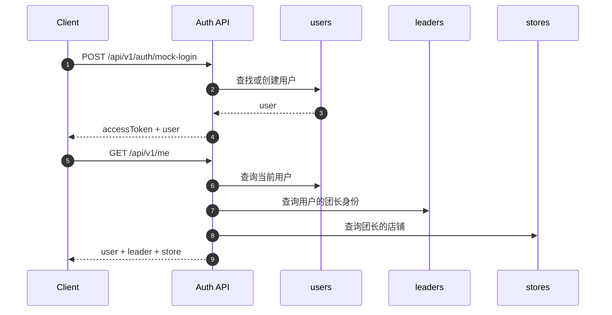
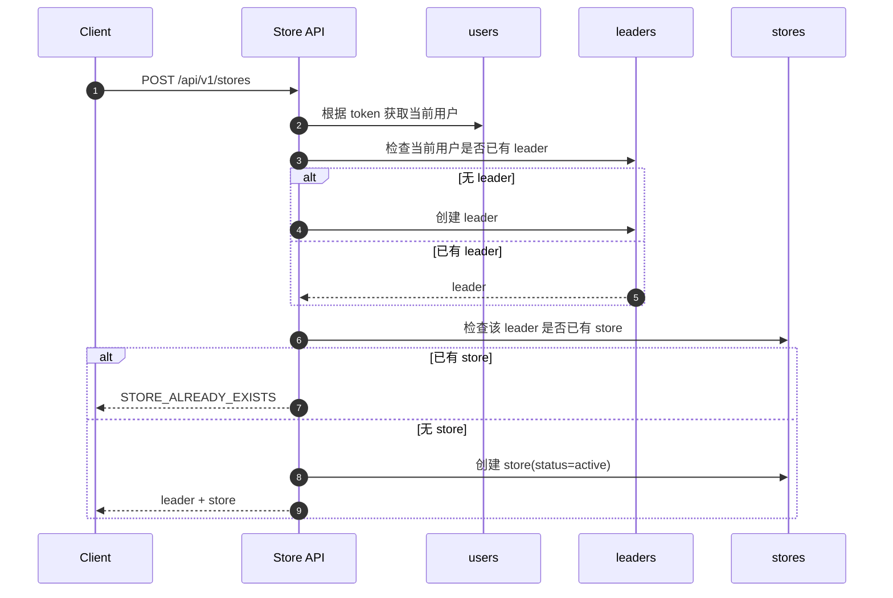
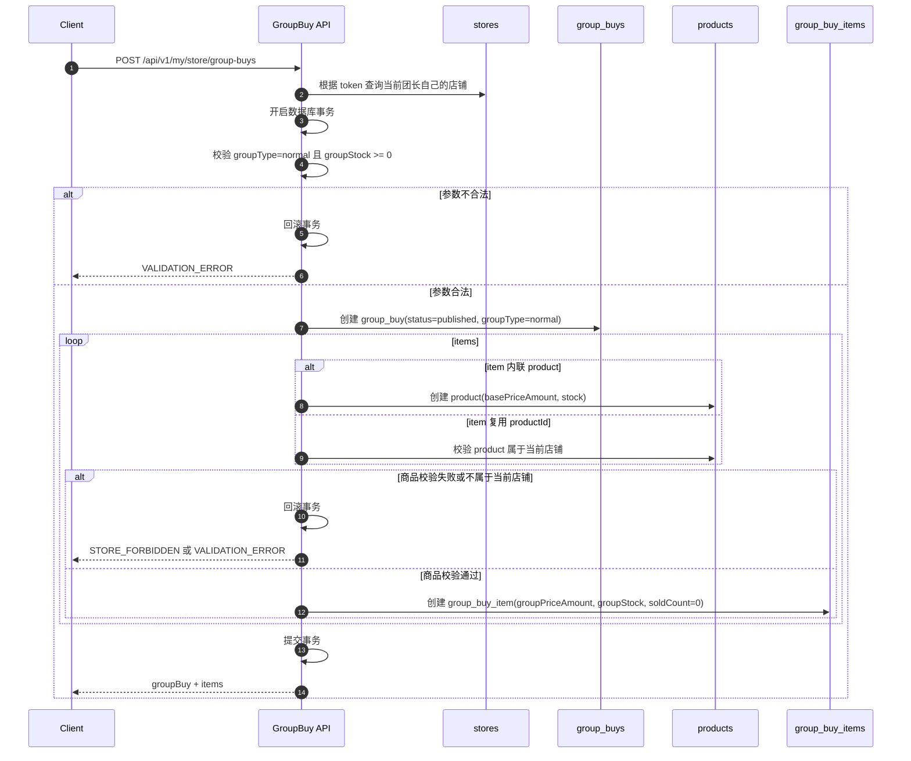
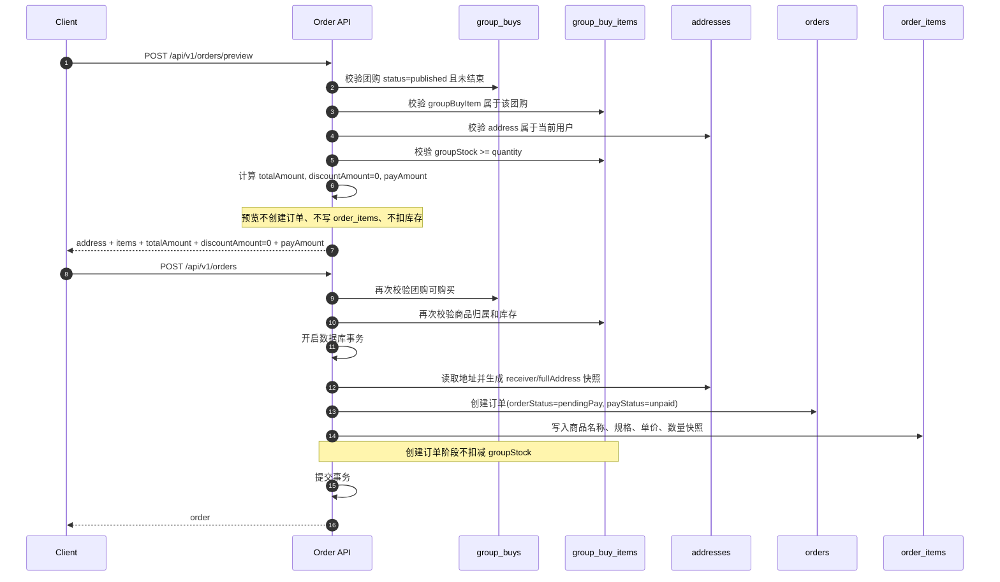
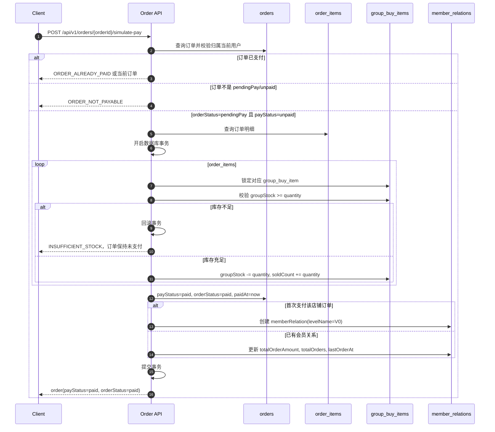
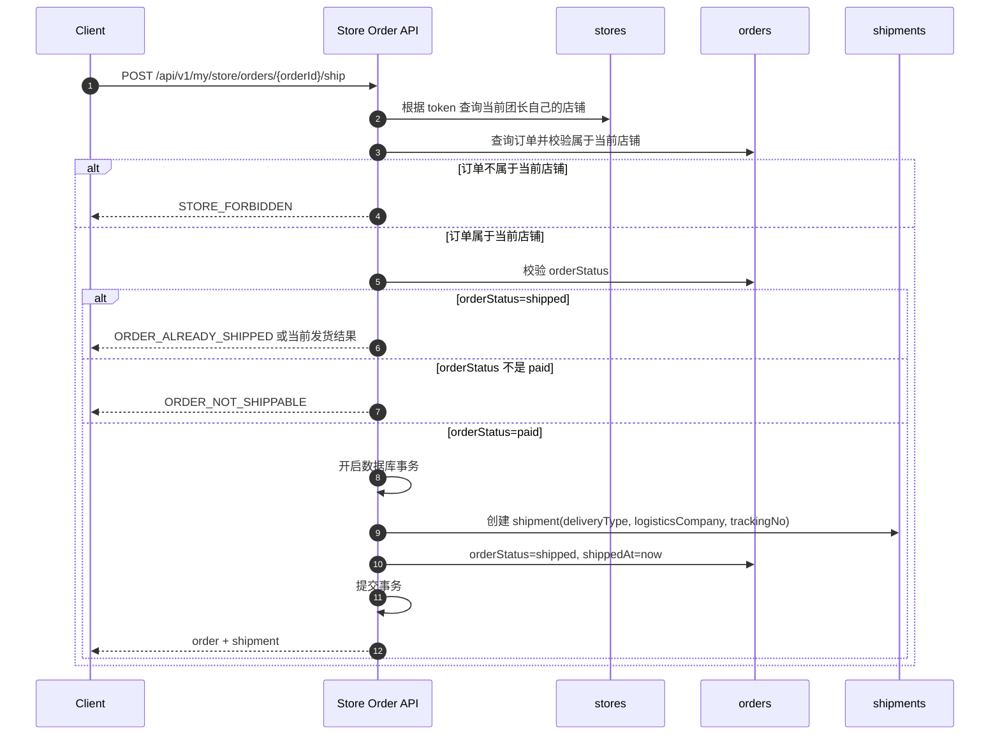
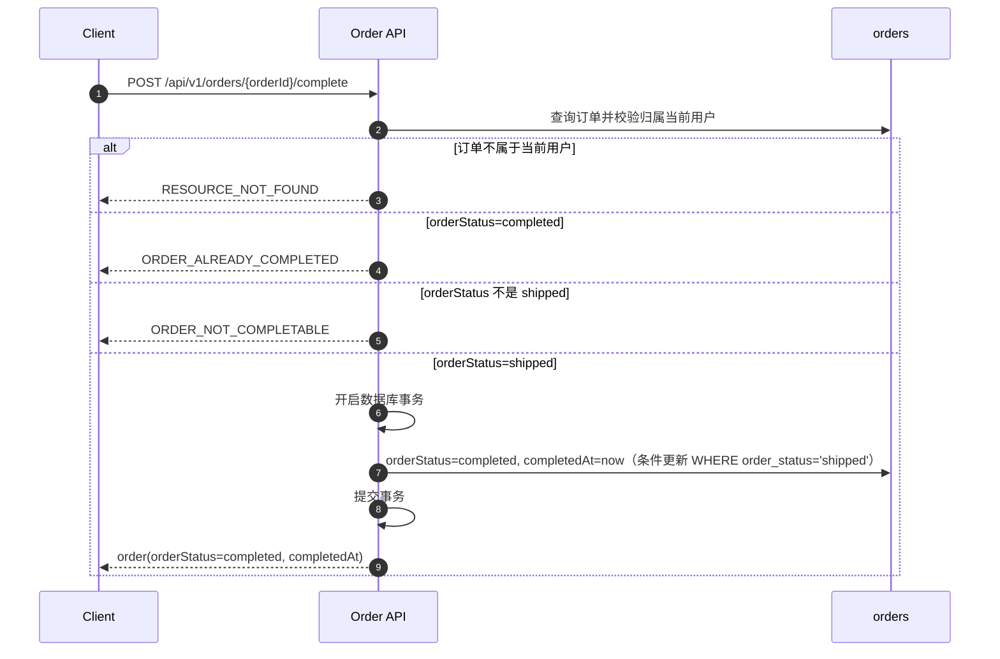
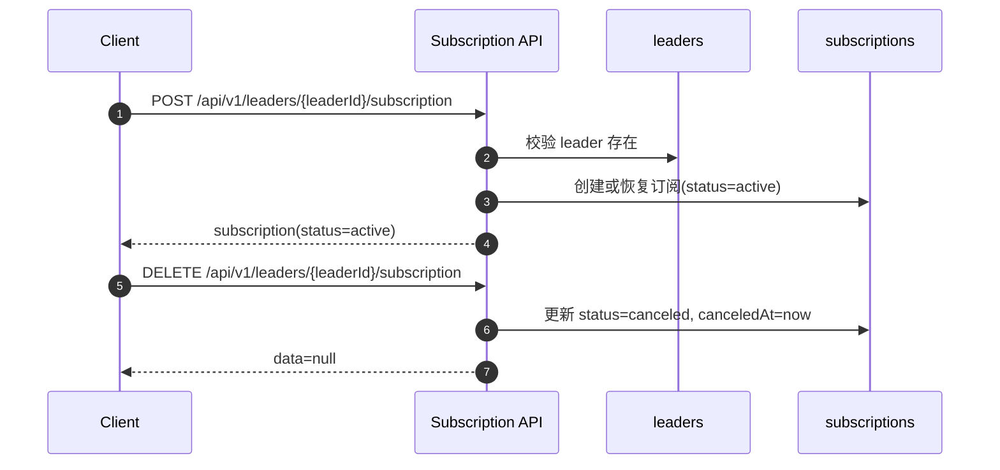

# API 设计

> 本文基于 `docs/功能需求定义.md` 和 `docs/数据模型设计.md` 编写，接口风格遵循 `docs/API风格规范.md`。
>
> 范围：只设计 MVP 必需 API。P1/P2 能力仅在文末列出，不展开接口细节。

---

## 1. 设计边界

MVP API 支撑以下闭环：

```text
用户浏览团购
→ 查看团长主页 / 商品详情
→ 登录后下单
→ 模拟支付
→ 查看订单
→ 团长发货
```

```text
用户登录
→ 创建店铺
→ 自动生成团长身份
→ 创建商品
→ 发布普通团购
→ 管理自己店铺的订单
```

MVP 不设计真实微信支付、优惠券、售后退款完整流程、帮卖分销、积分商城、平台后台、公众号推送。

MVP 统一约定：

| 约定 | 说明 |
|---|---|
| 金额 | API 层全部使用整数分，字段名以 `Amount` 结尾 |
| 状态 | API 使用 `camelCase` 枚举，如 `pendingPay`、`afterSale` |
| 数据库映射 | 如果数据库使用 `snake_case` 状态或 decimal 金额，由 DTO 层转换为 API 格式 |
| SKU | MVP 采用单规格方案，不设计 SKU 管理接口；`skuId` 作为 P1/P2 后续字段，不在 MVP 请求中使用 |
| 幂等 | MVP 不要求支持 `Idempotency-Key`；创建订单由前端防重复点击，支付/取消/发货通过状态校验和数据库事务防重复；`Idempotency-Key` 作为 P1 增强 |

---

## 2. API 模块总览

| 模块 | 说明 | 登录要求 |
|---|---|---|
| 认证与当前用户 | 登录、获取当前用户信息 | 部分需要 |
| 公共浏览 | 首页团购流、团购详情、团长主页 | 不需要 |
| 店铺与团长 | 创建店铺、查看自己的团长身份和店铺 | 需要 |
| 商品 | 团长管理自己店铺商品 | 需要团长身份 |
| 团购 | 团长发布普通团购，用户查看团购 | 部分需要 |
| 地址 | 用户管理收货地址 | 需要 |
| 订单 | 用户下单、查看订单、模拟支付、取消、确认收货 | 需要 |
| 团长订单 | 团长查看自己店铺订单、发货 | 需要团长身份 |
| 订阅 | 关注 / 取消关注团长 | 需要 |
| 会员卡 | 查看基础会员关系 | 需要 |

---

## 3. 通用对象摘要

### 3.1 User

```json
{
  "id": 1,
  "nickname": "用户昵称",
  "avatarUrl": "https://example.com/avatar.png",
  "phone": "13800000000",
  "hasLeader": true,
  "leaderId": 10,
  "storeId": 20
}
```

### 3.2 Leader

```json
{
  "id": 10,
  "userId": 1,
  "displayName": "某某团长",
  "avatarUrl": "https://example.com/avatar.png",
  "bio": "主营生鲜水果",
  "memberCount": 0,
  "followerCount": 0
}
```

### 3.3 Store

```json
{
  "id": 20,
  "leaderId": 10,
  "name": "某某的小店",
  "logoUrl": "https://example.com/logo.png",
  "description": "店铺简介",
  "defaultDeliveryType": "express",
  "distributionEnabled": false,
  "status": "active"
}
```

### 3.4 GroupBuy

```json
{
  "id": 100,
  "storeId": 20,
  "leaderId": 10,
  "title": "山东蜜桃团购",
  "introduction": "产地直发，香甜多汁",
  "coverImageUrl": "https://example.com/cover.png",
  "groupType": "normal",
  "deliveryType": "express",
  "shippingTime": "2026-06-30T18:00:00+08:00",
  "startTime": "2026-06-24T12:00:00+08:00",
  "endTime": "2026-07-01T12:00:00+08:00",
  "visibility": "public",
  "status": "published"
}
```

### 3.5 GroupBuyItem

```json
{
  "id": 1001,
  "groupBuyId": 100,
  "productId": 501,
  "displayName": "白玉蜜桃 5 斤装",
  "groupPriceAmount": 2990,
  "groupStock": 100,
  "soldCount": 0,
  "sortOrder": 1
}
```

说明：`groupStock` 表示当前剩余可售库存，发布团购时为初始可售库存，MVP 必须为大于等于 0 的整数，不允许使用 -1 表示不限库存；支付成功后按购买数量扣减。`soldCount` 表示已支付售出数量。

### 3.6 Order

```json
{
  "id": 9001,
  "orderNo": "202606240001",
  "userId": 1,
  "leaderId": 10,
  "storeId": 20,
  "groupBuyId": 100,
  "totalAmount": 2990,
  "discountAmount": 0,
  "payAmount": 2990,
  "payStatus": "unpaid",
  "orderStatus": "pendingPay",
  "remark": "请尽快发货",
  "receiverName": "张三",
  "receiverPhone": "13800000000",
  "province": "浙江省",
  "city": "杭州市",
  "district": "西湖区",
  "detail": "某某路 1 号",
  "fullAddress": "浙江省杭州市西湖区某某路 1 号",
  "paidAt": null,
  "shippedAt": null,
  "completedAt": null,
  "items": []
}
```

说明：`paidAt`、`shippedAt`、`completedAt` 为时间戳字符串（ISO-8601），对应状态未发生时字段可省略（无 null 值）；契约上允许 nullable。`paidAt` 在模拟支付成功后填充，`shippedAt` 在团长发货后填充，`completedAt` 在买家确认收货后填充。

---

## 4. 认证与当前用户

### 4.1 模拟登录

```http
POST /api/v1/auth/mock-login
```

用途：MVP 阶段用于模拟登录，后续替换为微信登录。

请求：

```json
{
  "nickname": "用户昵称",
  "avatarUrl": "https://example.com/avatar.png",
  "phone": "13800000000"
}
```

响应：

```json
{
  "success": true,
  "data": {
    "accessToken": "mock_access_token",
    "user": {
      "id": 1,
      "nickname": "用户昵称",
      "avatarUrl": "https://example.com/avatar.png",
      "phone": "13800000000",
      "hasLeader": false,
      "leaderId": null,
      "storeId": null
    }
  },
  "traceId": "req_001"
}
```

### 4.2 获取当前用户

```http
GET /api/v1/me
```

登录：需要。

响应：返回当前用户、团长身份和店铺摘要。

```json
{
  "success": true,
  "data": {
    "user": {
      "id": 1,
      "nickname": "用户昵称",
      "avatarUrl": "https://example.com/avatar.png",
      "phone": "13800000000",
      "hasLeader": true,
      "leaderId": 10,
      "storeId": 20
    },
    "leader": {
      "id": 10,
      "displayName": "某某团长",
      "avatarUrl": "https://example.com/avatar.png"
    },
    "store": {
      "id": 20,
      "name": "某某的小店",
      "logoUrl": "https://example.com/logo.png",
      "status": "active"
    }
  },
  "traceId": "req_001"
}
```

---

## 5. 公共浏览 API

### 5.1 首页团购列表

```http
GET /api/v1/group-buys
```

登录：不需要。

查询参数：

| 参数 | 类型 | 说明 |
|---|---|---|
| status | string | 默认 `published` |
| keyword | string | P1 搜索使用，MVP 可不支持 |
| page | number | 页码 |
| pageSize | number | 每页数量 |

响应：

```json
{
  "success": true,
  "data": {
    "items": [
      {
        "id": 100,
        "title": "山东蜜桃团购",
        "coverImageUrl": "https://example.com/cover.png",
        "status": "published",
        "endTime": "2026-07-01T12:00:00+08:00",
        "minPriceAmount": 2990,
        "soldCount": 12,
        "leader": {
          "id": 10,
          "displayName": "某某团长",
          "avatarUrl": "https://example.com/avatar.png"
        },
        "store": {
          "id": 20,
          "name": "某某的小店"
        }
      }
    ],
    "page": 1,
    "pageSize": 20,
    "total": 1,
    "hasMore": false
  },
  "traceId": "req_001"
}
```

### 5.2 团购详情

```http
GET /api/v1/group-buys/{groupBuyId}
```

登录：不需要。

响应：返回团购、团长、店铺、团购商品列表。

```json
{
  "success": true,
  "data": {
    "groupBuy": {
      "id": 100,
      "title": "山东蜜桃团购",
      "introduction": "产地直发，香甜多汁",
      "coverImageUrl": "https://example.com/cover.png",
      "groupType": "normal",
      "deliveryType": "express",
      "shippingTime": "2026-06-30T18:00:00+08:00",
      "startTime": "2026-06-24T12:00:00+08:00",
      "endTime": "2026-07-01T12:00:00+08:00",
      "status": "published"
    },
    "leader": {
      "id": 10,
      "displayName": "某某团长",
      "avatarUrl": "https://example.com/avatar.png",
      "followerCount": 0
    },
    "store": {
      "id": 20,
      "name": "某某的小店",
      "logoUrl": "https://example.com/logo.png"
    },
    "items": [
      {
        "id": 1001,
        "productId": 501,
        "displayName": "白玉蜜桃 5 斤装",
        "groupPriceAmount": 2990,
        "groupStock": 100,
        "soldCount": 12,
        "coverImageUrl": "https://example.com/product.png"
      }
    ],
    "viewer": {
      "subscribed": false
    }
  },
  "traceId": "req_001"
}
```

### 5.3 团长主页

```http
GET /api/v1/leaders/{leaderId}/homepage
```

登录：不需要。

查询参数：

| 参数 | 类型 | 说明 |
|---|---|---|
| page | number | 团购列表页码 |
| pageSize | number | 团购列表每页数量 |

响应：

```json
{
  "success": true,
  "data": {
    "leader": {
      "id": 10,
      "displayName": "某某团长",
      "avatarUrl": "https://example.com/avatar.png",
      "bio": "主营生鲜水果",
      "memberCount": 0,
      "followerCount": 0
    },
    "store": {
      "id": 20,
      "name": "某某的小店",
      "logoUrl": "https://example.com/logo.png",
      "description": "店铺简介",
      "defaultDeliveryType": "express"
    },
    "viewer": {
      "subscribed": false
    },
    "groupBuys": {
      "items": [],
      "page": 1,
      "pageSize": 20,
      "total": 0,
      "hasMore": false
    }
  },
  "traceId": "req_001"
}
```

---

## 6. 店铺与团长 API

### 6.0 `/my/store` 路径说明

`/my/store` 表示当前登录团长自己的店铺。

所有 `/my/store/**` 接口都从 token 获取当前用户身份，再由服务端查找当前用户对应的团长身份和店铺；客户端不能传 `storeId` 决定操作对象。

即使路径中出现 `productId`、`groupBuyId`、`orderId`，服务端也必须校验该资源属于当前团长自己的店铺。

### 6.1 创建店铺

```http
POST /api/v1/stores
```

登录：需要。

业务规则：

- 当前用户没有团长身份时，创建店铺会同时生成团长身份。
- MVP 阶段一个用户最多一个团长身份，一个团长最多一个店铺。
- 如果当前用户已创建店铺，返回 `STORE_ALREADY_EXISTS`。

重复提交：MVP 通过“一个用户只能创建一个店铺”的业务约束防止重复创建；不要求支持 `Idempotency-Key`，该请求头作为 P1 增强。

请求：

```json
{
  "name": "某某的小店",
  "logoUrl": "https://example.com/logo.png",
  "description": "店铺简介",
  "defaultDeliveryType": "express"
}
```

响应：

```json
{
  "success": true,
  "data": {
    "leader": {
      "id": 10,
      "displayName": "某某的小店",
      "avatarUrl": "https://example.com/logo.png"
    },
    "store": {
      "id": 20,
      "leaderId": 10,
      "name": "某某的小店",
      "logoUrl": "https://example.com/logo.png",
      "description": "店铺简介",
      "defaultDeliveryType": "express",
      "distributionEnabled": false,
      "status": "active"
    }
  },
  "traceId": "req_001"
}
```

端点错误码：

| 错误码 | 场景 |
|---|---|
| `UNAUTHORIZED` | 未登录 |
| `STORE_ALREADY_EXISTS` | 当前用户已创建店铺 |
| `VALIDATION_ERROR` | 店铺名称、物流方式等参数不合法 |

### 6.2 获取我的店铺

```http
GET /api/v1/my/store
```

登录：需要。

响应：返回当前用户自己的团长身份和店铺。未创建时返回 `data: null`。

### 6.3 更新我的店铺

```http
PATCH /api/v1/my/store
```

登录：需要团长身份。

请求：

```json
{
  "name": "新的店铺名称",
  "logoUrl": "https://example.com/logo.png",
  "description": "新的店铺简介",
  "defaultDeliveryType": "express"
}
```

响应：返回更新后的店铺。

---

## 7. 商品 API

### 7.1 我的店铺商品列表

```http
GET /api/v1/my/store/products
```

登录：需要团长身份。

查询参数：

| 参数 | 类型 | 说明 |
|---|---|---|
| page | number | 页码 |
| pageSize | number | 每页数量 |

响应：返回当前团长自己店铺下的商品列表。

### 7.2 创建商品

```http
POST /api/v1/my/store/products
```

登录：需要团长身份。

请求：

```json
{
  "name": "白玉蜜桃",
  "description": "山东蒙阴产地直发",
  "coverImageUrl": "https://example.com/product.png",
  "basePriceAmount": 2990,
  "stock": 100
}
```

响应：

```json
{
  "success": true,
  "data": {
    "id": 501,
    "storeId": 20,
    "name": "白玉蜜桃",
    "description": "山东蒙阴产地直发",
    "coverImageUrl": "https://example.com/product.png",
    "basePriceAmount": 2990,
    "stock": 100,
    "status": "active"
  },
  "traceId": "req_001"
}
```

### 7.3 商品详情

```http
GET /api/v1/my/store/products/{productId}
```

登录：需要团长身份，且商品必须属于自己的店铺。

响应：返回商品详情。

端点错误码：

| 错误码 | 场景 |
|---|---|
| `LEADER_REQUIRED` | 当前用户不是团长 |
| `STORE_FORBIDDEN` | 商品不属于当前团长自己的店铺 |
| `RESOURCE_NOT_FOUND` | 商品不存在 |

### 7.4 更新商品

```http
PATCH /api/v1/my/store/products/{productId}
```

登录：需要团长身份，且商品必须属于自己的店铺。

### 7.5 删除商品

```http
DELETE /api/v1/my/store/products/{productId}
```

登录：需要团长身份，且商品必须属于自己的店铺。

说明：MVP 可做软删除。若商品已被团购引用，不应影响历史订单快照。

---

## 8. 团购 API

### 8.1 创建并发布普通团购

```http
POST /api/v1/my/store/group-buys
```

登录：需要团长身份。

业务规则：

- MVP 只支持 `groupType = normal`。
- 一个团购至少包含一个团购商品。
- 团购商品价格是用户下单价格。
- MVP 可直接创建为 `published`，不做草稿保存。
- 推荐使用内联商品创建：团长在发布团购时可以直接在 `items` 中提交商品信息，后端在同一个事务中创建 `product` 和 `groupBuyItem`。
- 如果传入 `productId`，表示复用当前店铺已有商品；如果传入 `product`，表示发布时创建新商品。
- MVP 不使用 `skuId`，规格文本可放在 `displayName` 或 `product.name` 中。
- 创建团购、内联创建商品和创建团购商品关系必须在同一个事务中完成。
- `groupStock` 表示当前剩余可售库存，发布团购时填写的 `groupStock` 即初始可售库存。
- MVP 不允许 `groupStock = -1`，必须为大于等于 0 的整数。

请求：

```json
{
  "title": "山东蜜桃团购",
  "introduction": "产地直发，香甜多汁",
  "coverImageUrl": "https://example.com/cover.png",
  "deliveryType": "express",
  "shippingTime": "2026-06-30T18:00:00+08:00",
  "startTime": "2026-06-24T12:00:00+08:00",
  "endTime": "2026-07-01T12:00:00+08:00",
  "items": [
    {
      "product": {
        "name": "白玉蜜桃",
        "description": "山东蒙阴产地直发",
        "coverImageUrl": "https://example.com/product.png",
        "basePriceAmount": 2990,
        "stock": 100
      },
      "displayName": "白玉蜜桃 5 斤装",
      "groupPriceAmount": 2990,
      "groupStock": 100,
      "sortOrder": 1
    }
  ]
}
```

响应：返回团购和团购商品列表。

复用已有商品时的请求项：

```json
{
  "productId": 501,
  "displayName": "白玉蜜桃 5 斤装",
  "groupPriceAmount": 2990,
  "groupStock": 100,
  "sortOrder": 1
}
```

端点错误码：

| 错误码 | 场景 |
|---|---|
| `LEADER_REQUIRED` | 当前用户不是团长 |
| `STORE_FORBIDDEN` | 复用的商品不属于当前团长自己的店铺 |
| `VALIDATION_ERROR` | 团购或商品参数不合法 |

### 8.2 我的团购列表

```http
GET /api/v1/my/store/group-buys
```

登录：需要团长身份。

查询参数：

| 参数 | 类型 | 说明 |
|---|---|---|
| status | string | `published` / `ended` |
| page | number | 页码 |
| pageSize | number | 每页数量 |

响应：返回当前团长自己店铺发布的团购列表。

### 8.3 我的团购详情

```http
GET /api/v1/my/store/group-buys/{groupBuyId}
```

登录：需要团长身份，且团购必须属于自己的店铺。

响应：返回团购详情、团购商品列表和关联商品信息。

端点错误码：

| 错误码 | 场景 |
|---|---|
| `LEADER_REQUIRED` | 当前用户不是团长 |
| `STORE_FORBIDDEN` | 团购不属于当前团长自己的店铺 |
| `RESOURCE_NOT_FOUND` | 团购不存在 |

### 8.4 更新我的团购

```http
PATCH /api/v1/my/store/group-buys/{groupBuyId}
```

登录：需要团长身份，且团购必须属于自己的店铺。

说明：

- 允许修改标题、介绍、封面、开始时间、结束时间、发货时间等展示和活动字段。
- 团购产生订单后，不允许修改已下单 `groupBuyItem` 的价格。
- 不允许删除已被下单的团购商品。
- `groupStock` 是剩余可售库存，更新时不允许调整为负数。
- 若后端实现中存在“初始库存”字段或接口输入，则初始库存不得小于 `soldCount`，避免出现已售数量大于总库存的状态。
- 历史订单始终以订单明细快照为准，不受团购后续修改影响。

### 8.5 结束团购

```http
POST /api/v1/my/store/group-buys/{groupBuyId}/end
```

登录：需要团长身份，且团购必须属于自己的店铺。

业务规则：

- 只有 `published` 状态的团购可以结束。
- 结束后状态变为 `ended`。
- 已结束团购不允许继续下单。

响应：返回更新后的团购。

---

## 9. 地址 API

### 9.1 地址列表

```http
GET /api/v1/my/addresses
```

登录：需要。

### 9.2 创建地址

```http
POST /api/v1/my/addresses
```

登录：需要。

请求：

```json
{
  "receiverName": "张三",
  "receiverPhone": "13800000000",
  "province": "浙江省",
  "city": "杭州市",
  "district": "西湖区",
  "detail": "某某路 1 号",
  "isDefault": true
}
```

### 9.3 更新地址

```http
PATCH /api/v1/my/addresses/{addressId}
```

登录：需要，且只能更新自己的地址。

### 9.4 删除地址

```http
DELETE /api/v1/my/addresses/{addressId}
```

登录：需要，且只能删除自己的地址。

---

## 10. 订单 API

### 10.1 订单预览

```http
POST /api/v1/orders/preview
```

登录：需要。

用途：用于下单确认页，预览收货地址、商品明细、价格和库存。预览接口不创建订单、不扣库存、不占库存。

请求：

```json
{
  "groupBuyId": 100,
  "addressId": 300,
  "items": [
    {
      "groupBuyItemId": 1001,
      "quantity": 1
    }
  ]
}
```

响应：

```json
{
  "success": true,
  "data": {
    "groupBuyId": 100,
    "address": {
      "id": 300,
      "receiverName": "张三",
      "receiverPhone": "13800000000",
      "province": "浙江省",
      "city": "杭州市",
      "district": "西湖区",
      "detail": "某某路 1 号",
      "fullAddress": "浙江省杭州市西湖区某某路 1 号"
    },
    "items": [
      {
        "groupBuyItemId": 1001,
        "productId": 501,
        "productName": "白玉蜜桃 5 斤装",
        "skuName": "",
        "unitPriceAmount": 2990,
        "quantity": 1,
        "totalAmount": 2990,
        "availableStock": 100,
        "soldCount": 12
      }
    ],
    "totalAmount": 2990,
    "discountAmount": 0,
    "payAmount": 2990
  },
  "traceId": "req_001"
}
```

端点错误码：

| 错误码 | 场景 |
|---|---|
| `GROUP_BUY_NOT_PURCHASABLE` | 团购不是可购买状态 |
| `GROUP_BUY_ENDED` | 团购已结束 |
| `ITEM_NOT_IN_GROUP_BUY` | 商品不属于该团购 |
| `ADDRESS_FORBIDDEN` | 地址不属于当前用户 |
| `INSUFFICIENT_STOCK` | 库存不足 |

### 10.2 创建订单

```http
POST /api/v1/orders
```

登录：需要。

重复提交：MVP 创建订单不做强幂等，不要求支持 `Idempotency-Key`；前端需要对提交按钮做 loading/禁用来防重复点击。P1 再通过 `Idempotency-Key` 防止客户端重复提交创建多个订单。

业务规则：

- 只能购买 `published` 状态且未结束的团购。
- 下单价格以团购商品 `groupPriceAmount` 为准。
- 下单时写入商品名称、规格、单价、数量快照。
- 下单时必须保存收货地址快照：`receiverName`、`receiverPhone`、`province`、`city`、`district`、`detail`、`fullAddress`。
- 用户后续修改或删除地址，不得影响历史订单。
- MVP 建议不在创建订单时扣减库存；库存扣减发生在模拟支付成功时。
- 支付库存只以团购商品库存为准，`products.stock` 不参与支付扣减。
- MVP 不计算优惠券、红包、会员折扣和积分。

请求：

```json
{
  "groupBuyId": 100,
  "addressId": 300,
  "remark": "请尽快发货",
  "items": [
    {
      "groupBuyItemId": 1001,
      "quantity": 1
    }
  ]
}
```

响应：

```json
{
  "success": true,
  "data": {
    "id": 9001,
    "orderNo": "202606240001",
    "groupBuyId": 100,
    "storeId": 20,
    "leaderId": 10,
    "totalAmount": 2990,
    "discountAmount": 0,
    "payAmount": 2990,
    "payStatus": "unpaid",
    "orderStatus": "pendingPay",
    "remark": "请尽快发货",
    "receiverName": "张三",
    "receiverPhone": "13800000000",
    "province": "浙江省",
    "city": "杭州市",
    "district": "西湖区",
    "detail": "某某路 1 号",
    "fullAddress": "浙江省杭州市西湖区某某路 1 号",
    "items": [
      {
        "id": 1,
        "groupBuyItemId": 1001,
        "productId": 501,
        "productName": "白玉蜜桃 5 斤装",
        "skuName": "",
        "unitPriceAmount": 2990,
        "quantity": 1,
        "totalAmount": 2990
      }
    ]
  },
  "traceId": "req_001"
}
```

端点错误码：

| 错误码 | 场景 |
|---|---|
| `GROUP_BUY_NOT_PURCHASABLE` | 团购不是可购买状态 |
| `GROUP_BUY_ENDED` | 团购已结束 |
| `ITEM_NOT_IN_GROUP_BUY` | 商品不属于该团购 |
| `ADDRESS_FORBIDDEN` | 地址不属于当前用户 |
| `INSUFFICIENT_STOCK` | 库存不足 |
| `VALIDATION_ERROR` | 数量、地址、商品明细等参数不合法 |

### 10.3 我的订单列表

```http
GET /api/v1/my/orders
```

登录：需要。

查询参数：

| 参数 | 类型 | 说明 |
|---|---|---|
| status | string | `pendingPay` / `paid` / `shipped` / `completed` / `canceled` |
| page | number | 页码 |
| pageSize | number | 每页数量 |

响应：返回当前用户自己的订单列表。

### 10.4 订单详情

```http
GET /api/v1/my/orders/{orderId}
```

登录：需要。

权限：

- 买家可以查看自己的订单。
- 团长查看店铺订单使用团长订单接口。

### 10.5 模拟支付

```http
POST /api/v1/orders/{orderId}/simulate-pay
```

登录：需要，且订单必须属于当前用户。

重复提交：MVP 通过订单状态校验和数据库事务防止重复支付、重复扣库存或重复更新会员关系；`Idempotency-Key` 可作为 P1 增强。

业务规则：

- 只有 `orderStatus = pendingPay` 且 `payStatus = unpaid` 的订单可以模拟支付。
- 成功后 `payStatus = paid`，`orderStatus = paid`。
- MVP 在模拟支付成功时扣减 `groupStock` 并增加 `soldCount`。
- `groupStock` 表示当前剩余可售库存；支付成功后 `groupStock -= quantity`，`soldCount += quantity`。
- 支付只扣减 `groupBuyItems.groupStock`，不扣减 `products.stock`。
- 库存扣减、销量增加、订单状态更新、会员关系创建 / 更新必须在同一个事务中完成。
- 如果库存不足，返回 `INSUFFICIENT_STOCK`，订单保持未支付。
- 如果订单已支付，重复请求不能再次扣减库存或增加销量。
- 用户首次支付某店铺订单成功后创建 `memberRelation`。
- 后续支付成功更新会员关系的 `totalOrderAmount`、`totalOrders`、`lastOrderAt`。其中 `totalOrderAmount` 表示累计支付金额，使用整数分。
- MVP `levelName` 固定为 `V0`，`growthValue` 可固定为 0，或按累计支付金额做简单计算；若采用计算规则，需要在实现中保持一致。
- 不处理真实支付渠道、回调、对账和退款。

响应：返回更新后的订单。

端点错误码：

| 错误码 | 场景 |
|---|---|
| `ORDER_NOT_PAYABLE` | 订单不是可支付状态 |
| `ORDER_ALREADY_PAID` | 订单已支付，重复请求返回当前订单状态 |
| `INSUFFICIENT_STOCK` | 库存不足 |
| `RESOURCE_NOT_FOUND` | 订单不存在 |

### 10.6 取消订单

```http
POST /api/v1/orders/{orderId}/cancel
```

登录：需要，且订单必须属于当前用户。

重复提交：MVP 通过订单状态校验保证重复取消不会造成异常状态；`Idempotency-Key` 可作为 P1 增强。

业务规则：

- MVP 只允许取消 `orderStatus = pendingPay` 且 `payStatus = unpaid` 的订单。
- 取消后 `orderStatus = canceled`。

端点错误码：

| 错误码 | 场景 |
|---|---|
| `ORDER_NOT_CANCELABLE` | 订单当前状态不可取消 |
| `RESOURCE_NOT_FOUND` | 订单不存在 |

### 10.7 确认收货

```http
POST /api/v1/orders/{orderId}/complete
```

登录：需要，且订单必须属于当前用户。

业务规则：

- 只有 `shipped` 状态订单可以确认收货。
- 确认后 `orderStatus = completed`、`completedAt` 记录完成时间。
- 使用条件原子更新（`WHERE order_status = 'shipped'`）防止并发重复确认。

端点错误码：

| 错误码 | 场景 |
|---|---|
| `ORDER_NOT_COMPLETABLE` | 订单不是可确认收货状态（非 shipped） |
| `ORDER_ALREADY_COMPLETED` | 订单已完成，重复请求直接返回错误 |
| `RESOURCE_NOT_FOUND` | 订单不存在或不属于当前用户 |

---

## 11. 团长订单 API

### 11.1 我的店铺订单列表

```http
GET /api/v1/my/store/orders
```

登录：需要团长身份。

查询参数：

| 参数 | 类型 | 说明 |
|---|---|---|
| groupBuyId | number | 按团购筛选 |
| status | string | 订单状态 |
| page | number | 页码 |
| pageSize | number | 每页数量 |

权限：只能返回当前团长自己店铺产生的订单。

### 11.2 我的店铺订单详情

```http
GET /api/v1/my/store/orders/{orderId}
```

登录：需要团长身份。

权限：只能查看当前团长自己店铺产生的订单。

### 11.3 订单发货

```http
POST /api/v1/my/store/orders/{orderId}/ship
```

登录：需要团长身份。

重复提交：MVP 通过订单状态校验和数据库事务防止重复发货；`Idempotency-Key` 可作为 P1 增强。

业务规则：

- 只能处理自己店铺产生的订单。
- 只有 `paid` 状态订单可以发货。
- 发货后订单状态变为 `shipped`。

请求：

```json
{
  "deliveryType": "express",
  "logisticsCompany": "顺丰速运",
  "trackingNo": "SF123456789"
}
```

响应：返回更新后的订单和发货记录。

端点错误码：

| 错误码 | 场景 |
|---|---|
| `STORE_FORBIDDEN` | 订单不属于当前团长自己的店铺 |
| `ORDER_NOT_SHIPPABLE` | 订单不是可发货状态 |
| `ORDER_ALREADY_SHIPPED` | 订单已发货，重复请求返回当前发货结果 |
| `RESOURCE_NOT_FOUND` | 订单不存在 |

---

## 12. 订阅 API

### 12.1 订阅团长

```http
POST /api/v1/leaders/{leaderId}/subscription
```

登录：需要。

请求：

```json
{
  "source": "homepage"
}
```

业务规则：

- MVP 订阅只表示关注团长 / 店铺。
- 不做公众号推送、订阅邀请卡、订阅红包。
- 重复订阅可返回已有订阅关系，或返回 `SUBSCRIPTION_EXISTS`，实现时二选一并保持一致。

响应：

```json
{
  "success": true,
  "data": {
    "id": 7001,
    "userId": 1,
    "leaderId": 10,
    "storeId": 20,
    "status": "active",
    "source": "homepage",
    "subscribedAt": "2026-06-24T12:00:00+08:00"
  },
  "traceId": "req_001"
}
```

### 12.2 取消订阅

```http
DELETE /api/v1/leaders/{leaderId}/subscription
```

登录：需要。

响应：`data: null`。

### 12.3 我的订阅列表

```http
GET /api/v1/my/subscriptions
```

登录：需要。

响应：返回当前用户订阅的团长 / 店铺列表。

---

## 13. 会员卡 API

### 13.1 我的会员卡列表

```http
GET /api/v1/my/member-cards
```

登录：需要。

MVP 展示范围：

- 团长 / 店铺信息。
- 会员等级，例如 `V0`。
- 成长值。
- 累计消费。
- 累计订单。
- 不做等级升级规则、折扣计算、积分商城。

响应：

```json
{
  "success": true,
  "data": {
    "items": [
      {
        "id": 8001,
        "leader": {
          "id": 10,
          "displayName": "某某团长",
          "avatarUrl": "https://example.com/avatar.png"
        },
        "store": {
          "id": 20,
          "name": "某某的小店",
          "logoUrl": "https://example.com/logo.png"
        },
        "levelName": "V0",
        "growthValue": 0,
        "totalOrderAmount": 2990,
        "totalOrders": 1,
        "lastOrderAt": "2026-06-24T12:00:00+08:00"
      }
    ]
  },
  "traceId": "req_001"
}
```

---

## 14. 状态流转接口归属

| 状态变化 | 触发接口 |
|---|---|
| 用户无店铺 -> 已创建店铺 | `POST /api/v1/stores` |
| 用户无团长身份 -> 已生成团长身份 | `POST /api/v1/stores` |
| 团购未发布 -> 已发布 | `POST /api/v1/my/store/group-buys` |
| 团购已发布 -> 已结束 | `POST /api/v1/my/store/group-buys/{groupBuyId}/end` |
| 订单待支付 -> 已支付 | `POST /api/v1/orders/{orderId}/simulate-pay` |
| 订单待支付 -> 已取消 | `POST /api/v1/orders/{orderId}/cancel` |
| 订单已支付 -> 已发货 | `POST /api/v1/my/store/orders/{orderId}/ship` |
| 订单已发货 -> 已完成 | `POST /api/v1/orders/{orderId}/complete` |
| 未订阅 -> active | `POST /api/v1/leaders/{leaderId}/subscription` |
| active -> canceled | `DELETE /api/v1/leaders/{leaderId}/subscription` |

---

## 15. MVP 暂不展开的 API

| 能力 | 后续优先级 | 说明 |
|---|---:|---|
| 微信登录 | P1/P2 | MVP 使用模拟登录 |
| 真实微信支付 | P1/P2 | MVP 使用模拟支付 |
| 购物车 | P1 | MVP 直接下单 |
| 商品库独立管理 | P1 | MVP 商品直接挂店铺 |
| 优惠券 / 红包 | P1 | 不参与订单金额 |
| 售后退款 | P1 | MVP 只预留状态 |
| 隐私权限细分 | P1 | MVP 默认公开团购 |
| 分享海报 | P1 | MVP 可使用普通分享链接 |
| 帮卖分销 | P2 | 不设计佣金和结算 |
| 积分商城 | P2 | 不设计积分账户和兑换 |
| 公众号推送 | P2 | 不设计真实触达 |
| 平台管理后台 | P2 | 不设计后台 API |

---

## 16. 核心时序图

本章节只描述 MVP 范围内的 API 调用、服务端处理、数据表写入和状态变化。

### 16.1 模拟登录与获取当前用户信息



### 16.2 创建店铺并激活团长身份



### 16.3 发布普通团购



### 16.4 下单预览与创建订单



### 16.5 模拟支付



### 16.6 团长发货



### 16.7 确认收货



### 16.8 订阅与取消订阅团长


