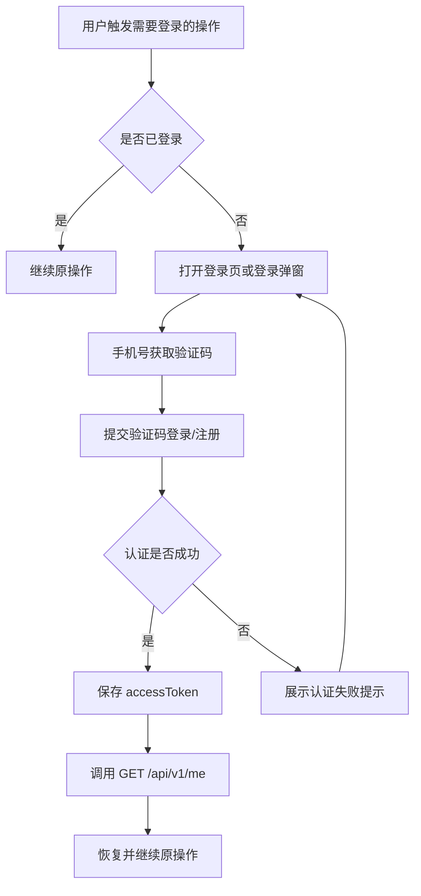
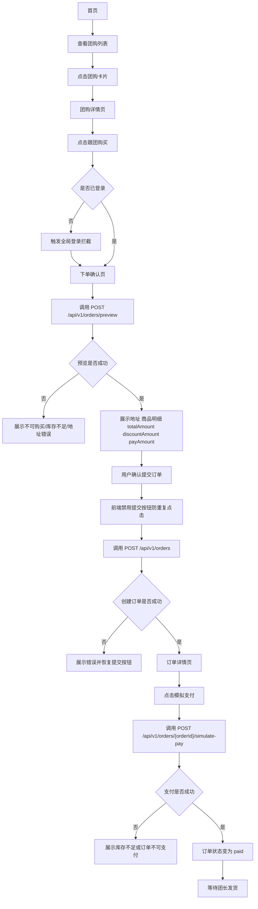
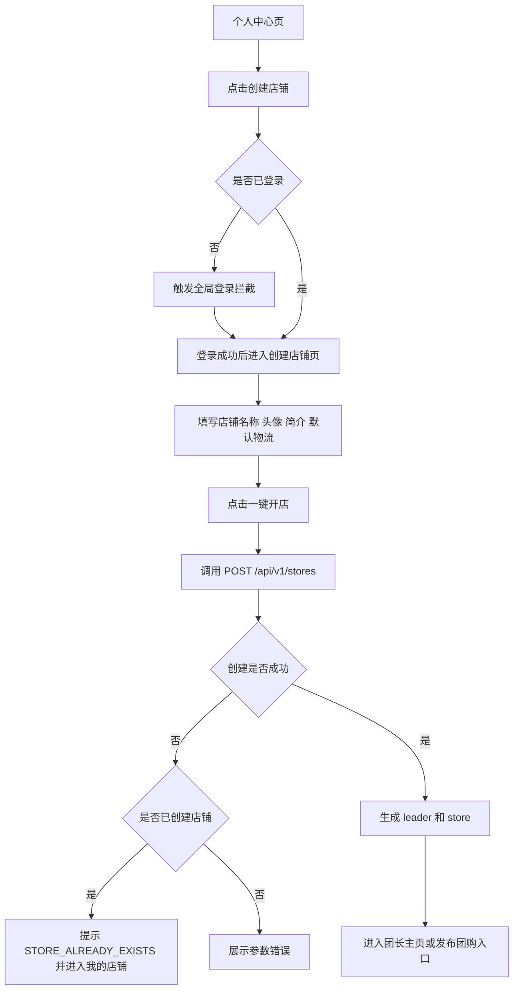
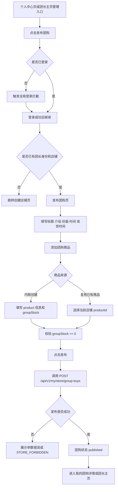
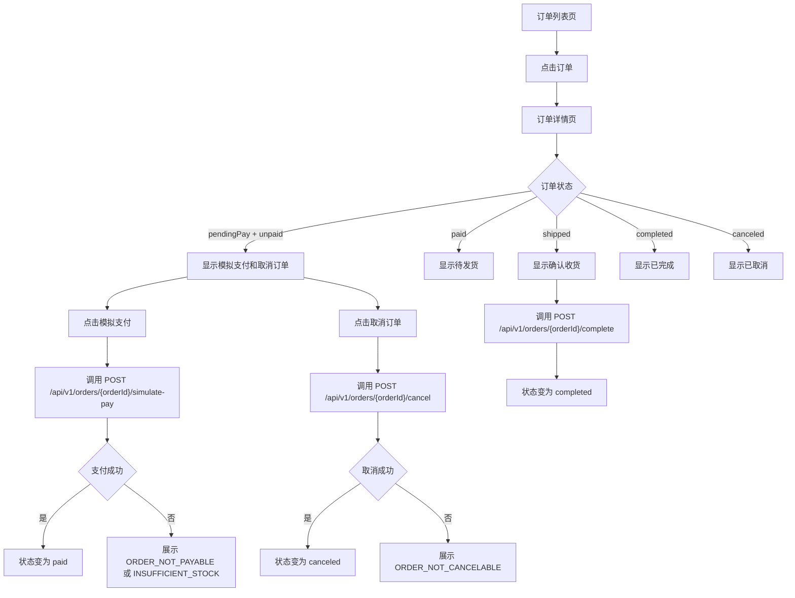
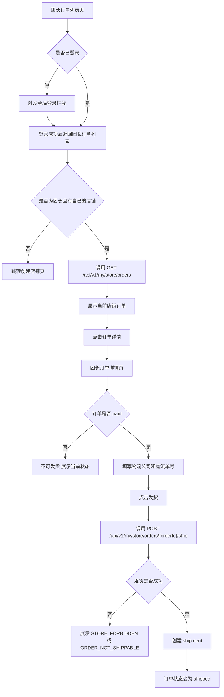
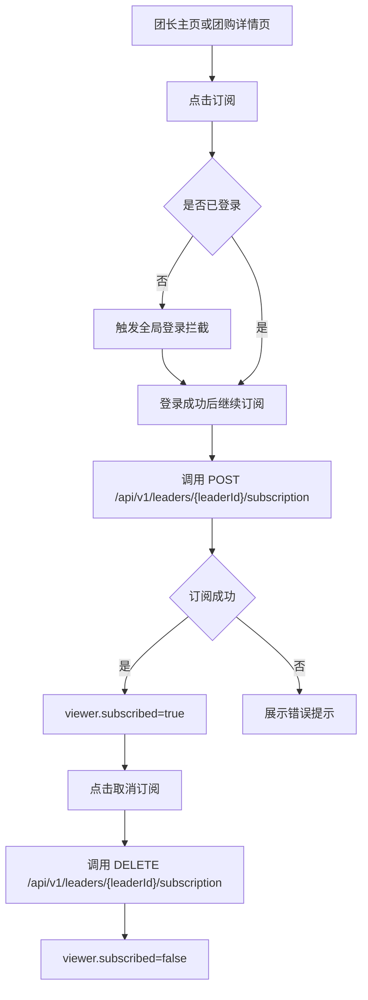
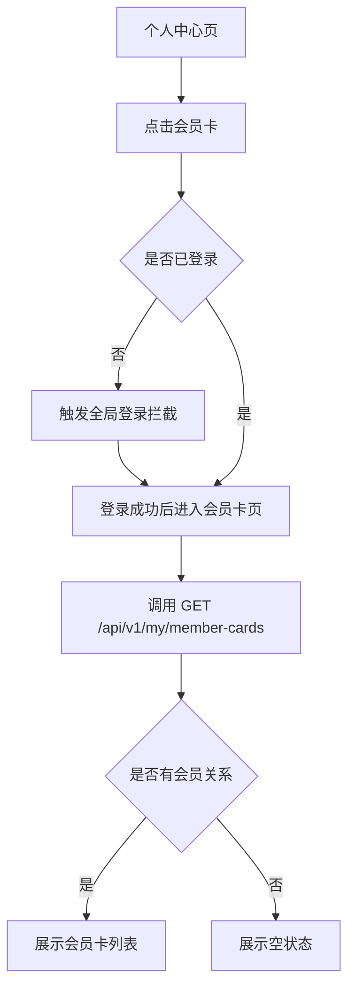
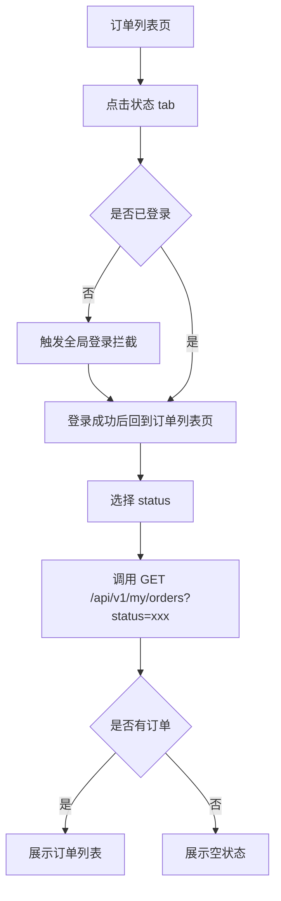

# 页面与交互文档

> 本文基于 `docs/功能需求定义.md`、`docs/API设计.md` 和 `docs/API风格规范.md` 编写。
>
> 范围：覆盖当前 H5 前端已实现和应接入的页面流程、交互状态与主要能力。真实微信支付、帮卖分销、积分商城、公众号 / 服务通知、平台后台和完整客服中心仍不在当前范围；购物车、优惠券、售后退款、站内通知和订单上下文轻量聊天已不再按占位能力处理。

---

## 1. 页面范围

| 页面 | 当前状态 | 说明 |
|---|---|---|
| 首页 | 实现 | 展示已发布团购列表 |
| 团购详情页 | 实现 | 展示团购、团长、店铺、团购商品、购物车和结构化内容 |
| 团长主页 | 实现 | 展示团长、店铺、团购列表、订阅状态和可领取优惠券 |
| 登录页 / 登录弹窗 | 实现 | MVP 使用模拟登录 |
| 下单确认页 | 实现 | 调用订单预览，展示地址、商品明细、优惠券和金额 |
| 订单列表页 | 实现 | 展示当前用户订单和履约 / 售后状态 |
| 订单详情页 | 实现 | 展示订单、地址快照、商品快照、状态、聊天入口和售后状态 |
| 个人中心页 | 实现 | 展示当前用户、店铺入口、订单入口、会员卡入口 |
| 创建店铺页 | 实现 | 创建店铺并激活团长身份 |
| 团长主页管理入口 | 实现 | 进入当前团长自己的店铺和团购管理 |
| 发布团购页 | 实现 | 支持商品库选择 / 内联创建、草稿、预售、结构化内容块和 AI 润色建议 |
| 团长订单列表页 | 实现 | 查看自己店铺订单 |
| 团长订单详情页 | 实现 | 发货操作、订单上下文聊天入口 |
| 团长优惠券页 | 实现 | 店铺优惠券创建、编辑、停用和列表 |
| 消息页 | 实现 | 站内通知、聊天会话、未读数轮询和通知分类入口 |
| 聊天详情页 | 实现 | 下单后的买家与店铺团长轻量聊天 |
| 会员卡页 | 实现 | 展示会员关系、成长值和等级信息 |

---

## 2. 全局登录拦截流程

登录拦截只在本节统一描述，其他业务流程只保留“是否已登录”的判断节点。



需要登录的典型操作：

| 操作 | 登录后继续 |
|---|---|
| 跟团购买 | 进入下单确认页 |
| 创建订单 | 停留在下单确认页并重试提交 |
| 模拟支付 | 回到订单详情页并继续支付 |
| 创建店铺 | 进入创建店铺页 |
| 发布团购 | 进入发布团购页 |
| 订阅团长 | 回到当前团长主页或团购详情 |
| 查看我的订单 / 会员卡 | 进入对应页面 |

---

## 3. 买家浏览与下单流程



关键交互约束：

| 节点 | 规则 |
|---|---|
| 下单确认页 | 必须先调用订单预览，不创建订单，不扣库存 |
| 提交订单 | MVP 不做强幂等，前端需要禁用按钮防重复点击 |
| 创建订单成功 | 订单为 `orderStatus=pendingPay`、`payStatus=unpaid` |
| 模拟支付成功 | 订单为 `orderStatus=paid`、`payStatus=paid` |
| 库存扣减 | 只扣减 `groupBuyItems.groupStock`，不扣减 `products.stock` |

---

## 4. 用户创建店铺流程



关键交互约束：

| 节点 | 规则 |
|---|---|
| 创建店铺 | 创建成功后同时激活团长身份 |
| 重复创建 | MVP 通过一个用户一个店铺的业务约束拦截 |
| `/my/store` | 后续店铺操作从 token 获取当前团长自己的店铺 |

---

## 5. 团长发布团购流程



关键交互约束：

| 节点 | 规则 |
|---|---|
| 团购类型 | MVP 只发布普通团购 |
| 商品创建 | 推荐内联创建商品，后端事务创建 product 和 groupBuyItem |
| 库存 | `groupStock` 必须大于等于 0，不允许 -1 |
| 团购修改 | 有订单后不可修改已下单团购商品价格，不可删除已下单团购商品 |

---

## 6. 用户订单状态流程



状态展示规则：

| 状态 | 页面操作 |
|---|---|
| `pendingPay` + `unpaid` | 可模拟支付、可取消 |
| `paid` + `paid` | 等待团长发货 |
| `shipped` | 可确认收货 |
| `completed` | 只展示结果 |
| `canceled` | 只展示结果 |

---

## 7. 团长订单发货流程



关键交互约束：

| 节点 | 规则 |
|---|---|
| 团长订单列表 | 只展示当前团长自己店铺产生的订单 |
| 发货 | 只有 `orderStatus=paid` 的订单可发货 |
| 发货成功 | 创建发货记录，订单状态变为 `shipped` |
| 重复发货 | MVP 通过订单状态校验和事务防重复 |

---

## 8. 订阅团长流程



说明：订阅表示关注团长 / 店铺，当前可触发站内通知；仍不做公众号推送、订阅邀请卡、订阅红包。

---

## 8.1 订单上下文轻量聊天流程（P2 部分先行）

```mermaid
flowchart TD
    A[买家订单列表/详情] --> B[点击联系团长]
    B --> C[POST /my/chat-conversations/orders/{orderId}]
    C --> D[聊天详情页]
    E[团长订单详情] --> F[点击联系买家或备货完成]
    F --> C
    D --> G[发送文字/图片/订单卡片]
    D --> H[每 5 秒轮询新消息]
    I[消息页] --> J[聊天/通知双 Tab]
```

规则：

- 只有下单后才开放聊天，不做团购详情或团长主页售前咨询。
- 会话按买家和店铺聚合，同一买家在同一店铺的多笔订单进入同一会话。
- “备货完成”只是聊天卡片，不改变订单状态。
- 消息页保留站内通知能力，同时新增聊天列表；底部消息角标显示聊天未读 + 通知未读。

---

## 9. 会员卡页流程



说明：MVP 会员卡只展示用户与团长 / 店铺的会员关系，不做等级升级、折扣计算、积分商城。

---

## 10. 订单列表筛选流程



状态范围：

| Tab 状态 | API status |
|---|---|
| 待支付 | `pendingPay` |
| 待发货 | `paid` |
| 已发货 | `shipped` |
| 已完成 | `completed` |
| 已取消 | `canceled` |
